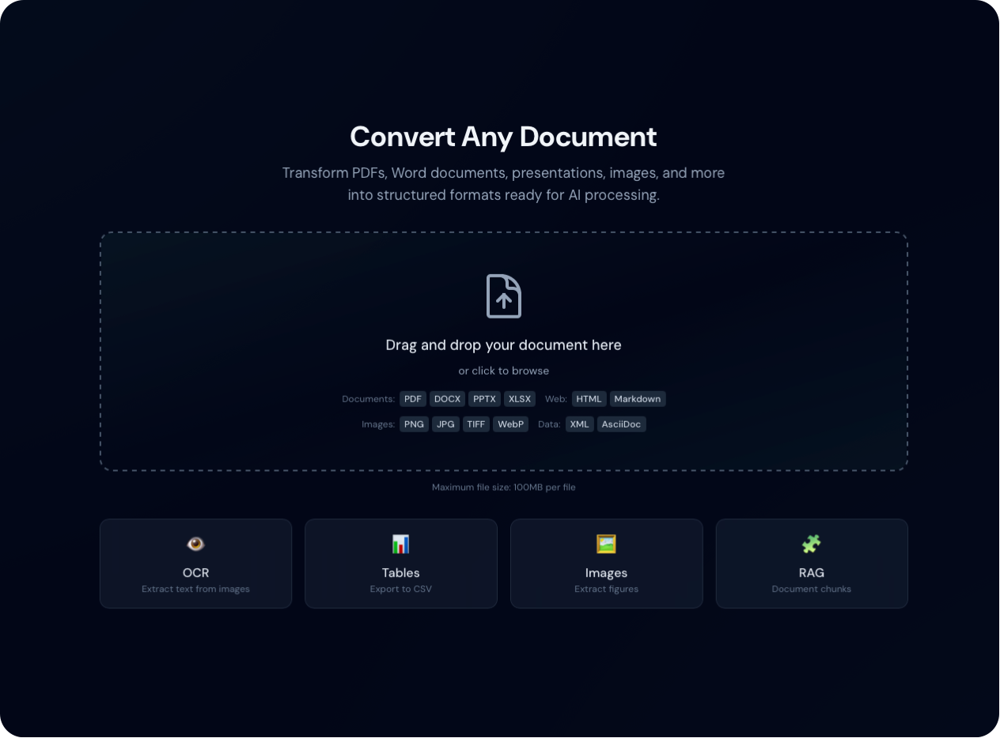

# Duckling

[](https://github.com/davidgs/duckling/actions/workflows/test.yml)
[](https://opensource.org/licenses/MIT)
[](https://www.python.org/downloads/)
[](https://nodejs.org/)
[](https://react.dev/)
[](https://flask.palletsprojects.com/)
[](https://github.com/psf/black)
[](https://www.typescriptlang.org/)

A modern, user-friendly graphical interface for [Docling](https://github.com/docling-project/docling) - the powerful document conversion library by IBM.



## Features

- **Drag-and-Drop Upload**: Simply drag your documents onto the interface
- **URL-Based Conversion**: Convert documents directly from URLs with automatic image extraction for HTML pages
- **Batch Processing**: Convert multiple files or URLs at once
- **Multi-Format Support**: Convert PDFs, Word docs, PowerPoints, Excel files, HTML, Markdown, images, and more
- **Multiple Export Formats**: Export to Markdown, HTML, JSON, DocTags, Document Tokens, RAG Chunks, or plain text
- **Image & Table Extraction**: Extract embedded images and tables with CSV export
- **Image Preview Gallery**: View extracted images as thumbnails with full-size lightbox viewer
- **RAG-Ready Chunking**: Generate document chunks optimized for RAG applications
- **Advanced OCR**: Multiple OCR backends with GPU acceleration support
- **Real-Time Progress**: Watch your document conversion progress in real-time
- **Conversion History**: Access previously converted documents
- **Highly Configurable**: Customize OCR, tables, images, performance, and chunking settings
- **Beautiful Dark Theme**: Easy on the eyes with a modern, professional design

## Supported Input Formats

| Format | Extensions | Description |
|--------|------------|-------------|
| PDF | `.pdf` | Portable Document Format |
| Word | `.docx` | Microsoft Word documents |
| PowerPoint | `.pptx` | Microsoft PowerPoint presentations |
| Excel | `.xlsx` | Microsoft Excel spreadsheets |
| HTML | `.html`, `.htm` | Web pages |
| Markdown | `.md`, `.markdown` | Markdown files |
| Images | `.png`, `.jpg`, `.jpeg`, `.tiff`, `.gif`, `.webp`, `.bmp` | Direct image OCR |
| AsciiDoc | `.asciidoc`, `.adoc` | Technical documentation |
| PubMed XML | `.xml` | Scientific articles |
| USPTO XML | `.xml` | Patent documents |

## Export Formats

| Format | Extension | Description |
|--------|-----------|-------------|
| Markdown | `.md` | Formatted text with headers, lists, links |
| HTML | `.html` | Web-ready format with styling |
| JSON | `.json` | Full document structure |
| Plain Text | `.txt` | Simple text without formatting |
| DocTags | `.doctags` | Tagged document format |
| Document Tokens | `.tokens.json` | Token-level representation |
| RAG Chunks | `.chunks.json` | Chunks for RAG applications |

## Quick Start

### Prerequisites

- Python 3.10+ (3.13 recommended)
- Node.js 18+
- npm or yarn

### Installation

1. **Clone the repository**:
   ```bash
   git clone https://github.com/davidgs/duckling.git
   cd duckling
   ```

2. **Set up the backend**:
   ```bash
   cd backend
   python -m venv venv
   source venv/bin/activate  # On Windows: venv\Scripts\activate
   pip install -r requirements.txt
   ```

3. **Set up the frontend**:
   ```bash
   cd ../frontend
   npm install
   ```

### Running the Application

1. **Start the backend** (in one terminal):
   ```bash
   cd backend
   source venv/bin/activate
   python app.py
   ```
   The API will be available at `http://localhost:5001`

2. **Start the frontend** (in another terminal):
   ```bash
   cd frontend
   npm run dev
   ```
   The UI will be available at `http://localhost:3000`

### Using Docker

## Documentation (MkDocs)

Duckling uses MkDocs + `mkdocs-static-i18n` for multilingual docs.

- Build (strict):

```bash
./scripts/docs-build.sh
```

- Serve locally:

```bash
./scripts/docs-serve.sh
```

**Quick Start (Build Locally):**
```bash
docker-compose up --build
```

**Using Pre-built Images:**
```bash
# Download and run pre-built images
curl -O https://raw.githubusercontent.com/davidgs/duckling/main/docker-compose.prebuilt.yml
docker-compose -f docker-compose.prebuilt.yml up -d
```

**Production Deployment:**
```bash
docker-compose -f docker-compose.yml -f docker-compose.prod.yml up -d
```

Access the application at `http://localhost:3000`

**Build Docker Images:**
```bash
# Build images locally
./scripts/docker-build.sh

# Build and push to registry
./scripts/docker-build.sh --push --registry yourusername
```

See [Docker Deployment Guide](docs/getting-started/docker.md) for detailed instructions.

## Configuration

### Backend Environment Variables

Create a `.env` file in the `backend` directory:

```env
FLASK_ENV=development
SECRET_KEY=your-secret-key
DEBUG=True
MAX_CONTENT_LENGTH=104857600  # 100MB
```

### Conversion Settings

Settings can be configured through the UI or via the API. All settings are organized into categories:

#### OCR Settings

| Setting | Description | Default |
|---------|-------------|---------|
| `enabled` | Enable/disable OCR | `true` |
| `backend` | OCR engine (easyocr, tesseract, ocrmac, rapidocr) | `easyocr` |
| `language` | Primary language for recognition | `en` |
| `force_full_page_ocr` | OCR entire page vs detected regions | `false` |
| `use_gpu` | Enable GPU acceleration (EasyOCR) | `false` |
| `confidence_threshold` | Minimum confidence for results | `0.5` |

**Supported Languages**: English, German, French, Spanish, Italian, Portuguese, Dutch, Polish, Russian, Japanese, Chinese (Simplified/Traditional), Korean, Arabic, Hindi, Thai, Vietnamese, Turkish, Ukrainian, Czech, Greek, Hebrew, Indonesian, Malay, Swedish, Danish, Finnish, Norwegian

#### Table Settings

| Setting | Description | Default |
|---------|-------------|---------|
| `enabled` | Enable table detection | `true` |
| `mode` | Detection mode (fast/accurate) | `accurate` |
| `do_cell_matching` | Match cell content to structure | `true` |
| `structure_extraction` | Preserve table structure | `true` |

#### Image Settings

| Setting | Description | Default |
|---------|-------------|---------|
| `extract` | Extract embedded images | `true` |
| `classify` | Classify and tag images | `true` |
| `generate_page_images` | Create page images | `false` |
| `generate_picture_images` | Extract pictures as files | `true` |
| `generate_table_images` | Extract tables as images | `true` |
| `images_scale` | Scale factor (0.1-4.0) | `1.0` |

#### Performance Settings

| Setting | Description | Default |
|---------|-------------|---------|
| `device` | Processing device (auto/cpu/cuda/mps) | `auto` |
| `num_threads` | CPU threads (1-32) | `4` |
| `document_timeout` | Max processing time (seconds) | `null` |

#### RAG Chunking Settings

| Setting | Description | Default |
|---------|-------------|---------|
| `enabled` | Enable document chunking | `false` |
| `max_tokens` | Maximum tokens per chunk | `512` |
| `merge_peers` | Merge undersized chunks | `true` |

## API Endpoints

### Conversion

| Endpoint | Method | Description |
|----------|--------|-------------|
| `/api/convert` | POST | Upload and convert a document |
| `/api/convert/batch` | POST | Batch convert multiple documents |
| `/api/convert/<job_id>/status` | GET | Get conversion status |
| `/api/convert/<job_id>/result` | GET | Get conversion result |
| `/api/convert/<job_id>/images` | GET | List extracted images |
| `/api/convert/<job_id>/images/<id>` | GET | Download extracted image |
| `/api/convert/<job_id>/tables` | GET | List extracted tables |
| `/api/convert/<job_id>/tables/<id>/csv` | GET | Download table as CSV |
| `/api/convert/<job_id>/chunks` | GET | Get document chunks |
| `/api/export/<job_id>/<format>` | GET | Download converted file |

### Settings

| Endpoint | Method | Description |
|----------|--------|-------------|
| `/api/settings` | GET/PUT | Get/update all settings |
| `/api/settings/reset` | POST | Reset to defaults |
| `/api/settings/formats` | GET | List supported formats |
| `/api/settings/ocr` | GET/PUT | OCR settings |
| `/api/settings/tables` | GET/PUT | Table settings |
| `/api/settings/images` | GET/PUT | Image settings |
| `/api/settings/performance` | GET/PUT | Performance settings |
| `/api/settings/chunking` | GET/PUT | Chunking settings |
| `/api/settings/output` | GET/PUT | Output settings |

### History

| Endpoint | Method | Description |
|----------|--------|-------------|
| `/api/history` | GET | List conversion history |
| `/api/history/<job_id>` | GET | Get history entry |
| `/api/history/stats` | GET | Get conversion statistics |
| `/api/history/search` | GET | Search history |

## Development

### Running Tests

**Backend tests**:
```bash
cd backend
pytest
```

**Frontend tests**:
```bash
cd frontend
npm test
```

### Project Structure

```
duckling/
├── backend/
│   ├── app.py              # Flask application
│   ├── config.py           # Configuration & defaults
│   ├── models/             # Database models
│   ├── routes/             # API endpoints
│   │   ├── convert.py      # Conversion endpoints
│   │   ├── settings.py     # Settings endpoints
│   │   └── history.py      # History endpoints
│   ├── services/           # Business logic
│   │   ├── converter.py    # Docling integration
│   │   ├── file_manager.py # File handling
│   │   └── history.py      # History management
│   └── tests/              # Backend tests
├── frontend/
│   ├── src/
│   │   ├── components/     # React components
│   │   │   ├── DropZone.tsx
│   │   │   ├── ConversionProgress.tsx
│   │   │   ├── ExportOptions.tsx
│   │   │   ├── SettingsPanel.tsx
│   │   │   └── HistoryPanel.tsx
│   │   ├── hooks/          # Custom hooks
│   │   │   ├── useConversion.ts
│   │   │   └── useSettings.ts
│   │   ├── services/       # API client
│   │   └── types/          # TypeScript types
│   └── tests/              # Frontend tests
├── uploads/                # Temporary uploads
├── outputs/                # Converted files
└── docker-compose.yml      # Docker configuration
```

## Documentation

Comprehensive documentation is available using MkDocs:

### In-App Documentation

The documentation is available directly in the Duckling UI. Click the **Documentation** button in the header to open the docs panel.

### UI + Docs Languages

- **UI**: English (`en`), Spanish (`es`), French (`fr`), German (`de`)
- **Docs**: Built and served with language prefixes at `/api/docs/site/en/`, `/api/docs/site/es/`, `/api/docs/site/fr/`, `/api/docs/site/de/`

To add a new language:
- **UI**: add `frontend/src/locales/<lang>/common.json` and wire it into `frontend/src/i18n.ts`
- **Docs**: add `docs/<lang>/...` (mirroring the English structure), then add a language entry under the `i18n` plugin in `mkdocs.yml`

**Note**: The documentation must be built before it can be viewed in the UI. You can either:

1. **Build manually** (recommended for development):
   ```bash
   pip install -r requirements-docs.txt
   mkdocs build
   ```

2. **Build from the UI**: Click the "Build Documentation" button in the docs panel if the site hasn't been built yet.

3. **Auto-build**: The backend will automatically attempt to build the docs if MkDocs is installed and the site doesn't exist.

### View Documentation Locally

```bash
# Install documentation dependencies
pip install -r requirements-docs.txt

# Serve documentation with live reload (for editing)
mkdocs serve
```

Then open `http://localhost:8000` in your browser.

### Build Documentation

```bash
mkdocs build
```

The built documentation will be in the `site/` directory and served at `/api/docs/site/` by the backend.

### Documentation Sections

- **[Getting Started](docs/getting-started/index.md)** - Installation and quick start
- **[User Guide](docs/user-guide/index.md)** - Features and configuration
- **[API Reference](docs/api/index.md)** - Complete API documentation
- **[Architecture](docs/architecture/index.md)** - System design and components
- **[Deployment](docs/deployment/index.md)** - Production deployment guide
- **[Contributing](docs/contributing/index.md)** - How to contribute

## Contributing

See [CONTRIBUTING.md](CONTRIBUTING.md) for guidelines.

## Security

See [SECURITY.md](SECURITY.md) for security policies.

## License

This project is licensed under the MIT License - see [LICENSE](LICENSE) for details.

## Acknowledgments

- [Docling](https://github.com/docling-project/docling) by IBM for the powerful document conversion engine
- [React](https://react.dev/) for the frontend framework
- [Flask](https://flask.palletsprojects.com/) for the backend framework
- [Tailwind CSS](https://tailwindcss.com/) for styling
- [Framer Motion](https://www.framer.com/motion/) for animations

