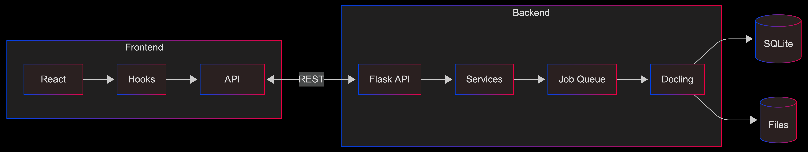
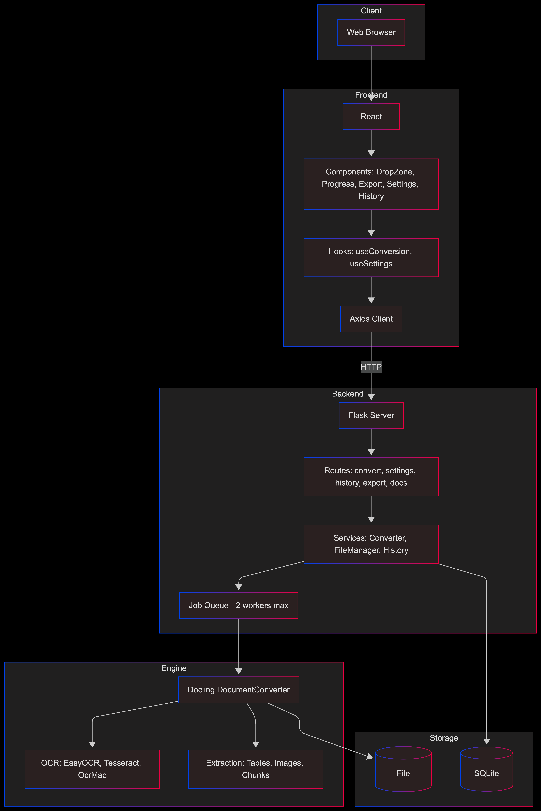
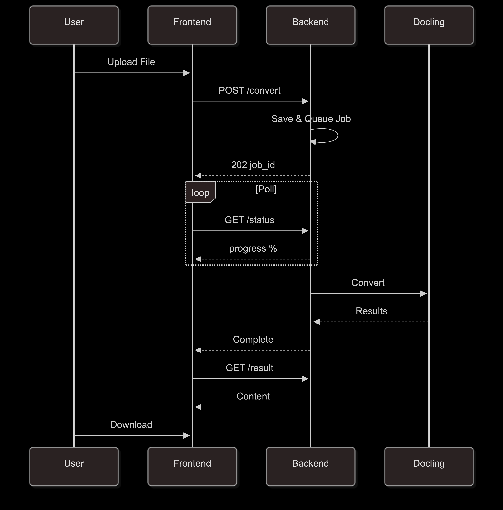
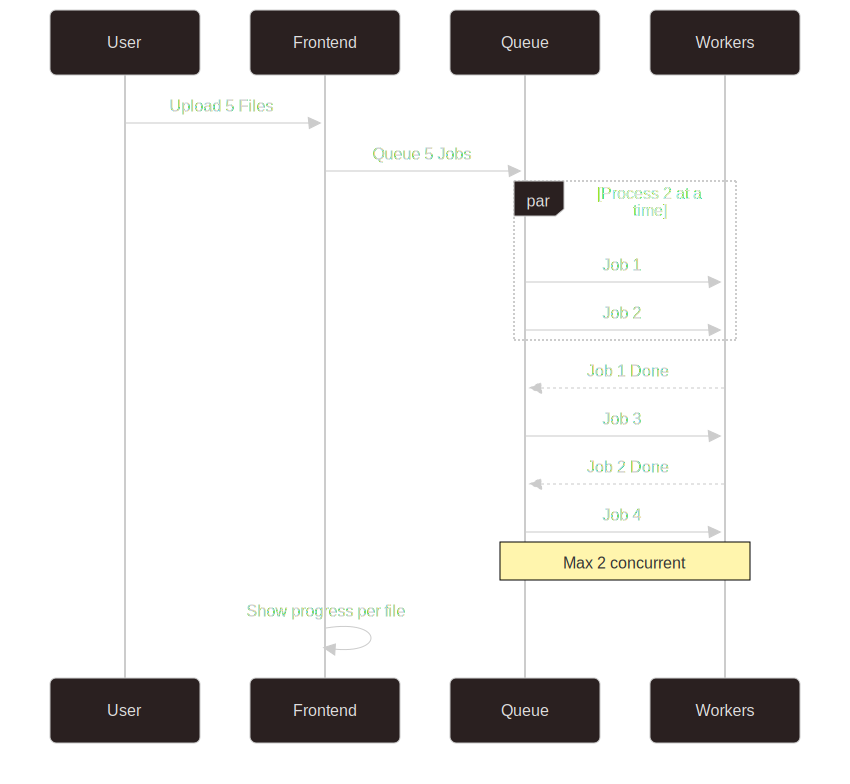

# Docling UI Architecture

This document describes the technical architecture of Docling UI.

## System Overview

Docling UI is a full-stack web application with a clear separation between frontend and backend:



### Detailed Layer View



---

## Frontend Architecture

### Technology Stack

- **React 18** - UI framework with functional components and hooks
- **TypeScript** - Type-safe JavaScript
- **Tailwind CSS** - Utility-first CSS framework
- **Framer Motion** - Animation library
- **React Query** - Server state management
- **Axios** - HTTP client
- **Vite** - Build tool and dev server

### Component Structure



| Path | Description |
|------|-------------|
| `src/App.tsx` | Main application component |
| `src/main.tsx` | Application entry point |
| `src/index.css` | Global styles |
| `src/components/DropZone.tsx` | File upload with drag-and-drop |
| `src/components/ConversionProgress.tsx` | Progress display |
| `src/components/ExportOptions.tsx` | Download and preview results |
| `src/components/SettingsPanel.tsx` | Configuration panel |
| `src/components/HistoryPanel.tsx` | Conversion history |
| `src/components/DocsPanel.tsx` | Documentation viewer |
| `src/hooks/useConversion.ts` | Conversion state and actions |
| `src/hooks/useSettings.ts` | Settings state management |
| `src/services/api.ts` | API client functions |
| `src/types/index.ts` | TypeScript interfaces |

### State Management

The application uses a combination of:

1. **Local State** - Component-level state with `useState`
2. **React Query** - Server state caching and synchronization
3. **Custom Hooks** - Encapsulated business logic

### Key Hooks

#### `useConversion`
Manages the document conversion workflow:
- File upload (single and batch)
- Status polling
- Result retrieval
- Download handling

#### `useSettings`
Manages application settings:
- OCR, table, image, performance, chunking settings
- Settings persistence via API
- Settings validation

---

## Backend Architecture

### Technology Stack

- **Flask** - Web framework
- **SQLAlchemy** - ORM for database operations
- **SQLite** - Embedded database for history
- **Docling** - Document conversion engine
- **Threading** - Async job processing

### Module Structure

| Path | Description |
|------|-------------|
| `backend/app.py` | Flask application factory |
| `backend/config.py` | Configuration and defaults |
| `backend/models/database.py` | SQLAlchemy models |
| `backend/routes/convert.py` | Conversion endpoints |
| `backend/routes/settings.py` | Settings endpoints |
| `backend/routes/history.py` | History endpoints |
| `backend/services/converter.py` | Docling integration |
| `backend/services/file_manager.py` | File operations |
| `backend/services/history.py` | History CRUD |
| `backend/tests/` | Test suite |

---

## Conversion Pipeline



| Step | Description |
|------|-------------|
| 1 | **Upload Request** - File received via POST |
| 2 | **File Validation & Storage** - Check extension, save to uploads/ |
| 3 | **Job Creation** - UUID assigned, entry created |
| 4 | **Queue for Processing** - Added to job queue |
| 5 | **Worker Thread Picks Up Job** - When capacity available |
| 6 | **DocumentConverter Initialized** - With OCR, table, image settings |
| 7 | **Document Conversion** - Extract images, tables, chunks |
| 8 | **Export to Formats** - MD, HTML, JSON, TXT, DocTags, Tokens |
| 9 | **Update Job Status & History** - Mark complete, store metadata |
| 10 | **Results Available** - Ready for download |

---

## Job Queue System

To prevent memory exhaustion when processing multiple documents:

```python
class ConverterService:
    _job_queue: Queue       # Pending jobs
    _worker_thread: Thread  # Background processor
    _max_concurrent_jobs = 2  # Limit parallel processing
```

The worker thread:
1. Monitors the job queue
2. Starts conversion threads up to the concurrent limit
3. Tracks active threads and cleans up completed ones
4. Prevents resource exhaustion during batch processing

---

## OCR Integration



Docling supports multiple OCR backends:

| Backend | Description | GPU Support |
|---------|-------------|-------------|
| **EasyOCR** | General-purpose, multi-language | Yes |
| **Tesseract** | Classic OCR engine | No |
| **OcrMac** | macOS Vision framework | No |
| **RapidOCR** | Fast ONNX-based | No |

The backend automatically falls back to non-OCR processing if OCR initialization fails.

---

## Data Flow

### Batch Processing



| Step | Description |
|------|-------------|
| 1 | Frontend sends POST /convert/batch with multiple files |
| 2 | Backend saves each file, creates jobs, queues all |
| 3 | Backend returns 202 with array of job IDs |
| 4 | Frontend polls status for each job simultaneously |
| 5 | Backend processes max 2 jobs at a time, queues rest |
| 6 | Frontend displays per-file progress |

---

## Database Schema

### Conversion Table

| Column | Type | Description |
|--------|------|-------------|
| `id` | VARCHAR(36) | Primary key (UUID) |
| `filename` | VARCHAR(255) | Sanitized filename |
| `original_filename` | VARCHAR(255) | Original upload name |
| `input_format` | VARCHAR(50) | Detected format |
| `status` | VARCHAR(50) | pending/processing/completed/failed |
| `confidence` | FLOAT | OCR confidence score |
| `error_message` | TEXT | Error details if failed |
| `output_path` | VARCHAR(500) | Path to output files |
| `settings` | TEXT | JSON settings used |
| `file_size` | FLOAT | File size in bytes |
| `created_at` | DATETIME | Upload timestamp |
| `completed_at` | DATETIME | Completion timestamp |

---

## Security Considerations

| Concern | Mitigation |
|---------|------------|
| **File Upload** | Only allowed extensions accepted |
| **File Size** | Configurable max (default 100MB) |
| **Filenames** | Sanitized before storage |
| **File Access** | Served through API only, no direct paths |
| **CORS** | Restricted to frontend origin |

---

## Performance Optimizations

| Optimization | Description |
|--------------|-------------|
| **Converter Caching** | DocumentConverter instances cached by settings hash |
| **Job Queue** | Sequential processing prevents memory exhaustion |
| **Lazy Loading** | Heavy components loaded on demand |
| **React Query Caching** | API responses cached and deduplicated |
| **Background Processing** | Conversions don't block the API |

---

## Scaling Architecture

For production deployments with high traffic:


---

## Deployment Options

### Development

```bash
# Backend
cd backend && python app.py

# Frontend
cd frontend && npm run dev
```

### Production (Docker)

```bash
docker-compose up --build
```

### Production (Manual)

```bash
# Backend with Gunicorn
cd backend
gunicorn -w 4 -b 0.0.0.0:5001 app:app

# Frontend build
cd frontend
npm run build
# Serve dist/ with nginx
```
