# Docling UI Deployment Guide

This guide covers deploying Docling UI in various environments.

## Table of Contents

- [Development Setup](#development-setup)
- [Docker Deployment](#docker-deployment)
- [Production Deployment](#production-deployment)
- [Reverse Proxy Configuration](#reverse-proxy-configuration)
- [Scaling Considerations](#scaling-considerations)

---

## Development Setup

### Prerequisites

- Python 3.10+ (3.13 recommended)
- Node.js 18+
- npm or yarn
- Git

### Quick Start

```bash
# Clone repository
git clone https://github.com/yourusername/docling-ui.git
cd docling-ui

# Backend setup
cd backend
python -m venv venv
source venv/bin/activate  # Windows: venv\Scripts\activate
pip install -r requirements.txt

# Frontend setup
cd ../frontend
npm install
```

### Running Development Servers

**Terminal 1 - Backend:**
```bash
cd backend
source venv/bin/activate
python app.py
```
Backend runs at: `http://localhost:5001`

**Terminal 2 - Frontend:**
```bash
cd frontend
npm run dev
```
Frontend runs at: `http://localhost:3000`

---

## Docker Deployment

### Using Docker Compose (Recommended)

```bash
# Build and start
docker-compose up --build

# Run in background
docker-compose up -d --build

# View logs
docker-compose logs -f

# Stop
docker-compose down
```

Access at: `http://localhost:3000`

### Docker Compose Configuration

```yaml
# docker-compose.yml
version: '3.8'

services:
  backend:
    build: ./backend
    ports:
      - "5001:5001"
    volumes:
      - ./uploads:/app/uploads
      - ./outputs:/app/outputs
    environment:
      - FLASK_ENV=production
      - SECRET_KEY=${SECRET_KEY:-change-me-in-production}
    healthcheck:
      test: ["CMD", "curl", "-f", "http://localhost:5001/api/health"]
      interval: 30s
      timeout: 10s
      retries: 3

  frontend:
    build: ./frontend
    ports:
      - "3000:80"
    depends_on:
      - backend
```

### Building Individual Images

**Backend:**
```bash
cd backend
docker build -t docling-ui-backend .
docker run -p 5001:5001 -v $(pwd)/uploads:/app/uploads docling-ui-backend
```

**Frontend:**
```bash
cd frontend
docker build -t docling-ui-frontend .
docker run -p 3000:80 docling-ui-frontend
```

---

## Production Deployment

### Backend with Gunicorn

```bash
cd backend
source venv/bin/activate
pip install gunicorn

# Run with Gunicorn
gunicorn -w 4 -b 0.0.0.0:5001 app:app
```

**Recommended Gunicorn Configuration:**

```bash
gunicorn \
  --workers 4 \
  --threads 2 \
  --timeout 300 \
  --bind 0.0.0.0:5001 \
  --access-logfile /var/log/docling/access.log \
  --error-logfile /var/log/docling/error.log \
  app:app
```

### Frontend Build

```bash
cd frontend
npm run build
```

The `dist/` directory contains static files ready for deployment.

### Serving Frontend with Nginx

```nginx
# /etc/nginx/sites-available/docling-ui
server {
    listen 80;
    server_name your-domain.com;

    root /var/www/docling-ui/dist;
    index index.html;

    # Frontend routes
    location / {
        try_files $uri $uri/ /index.html;
    }

    # API proxy
    location /api/ {
        proxy_pass http://localhost:5001/api/;
        proxy_http_version 1.1;
        proxy_set_header Host $host;
        proxy_set_header X-Real-IP $remote_addr;
        proxy_set_header X-Forwarded-For $proxy_add_x_forwarded_for;
        proxy_set_header X-Forwarded-Proto $scheme;

        # For file uploads
        client_max_body_size 100M;
        proxy_read_timeout 300s;
    }
}
```

### Systemd Service

Create `/etc/systemd/system/docling-ui.service`:

```ini
[Unit]
Description=Docling UI Backend
After=network.target

[Service]
User=www-data
Group=www-data
WorkingDirectory=/opt/docling-ui/backend
Environment="PATH=/opt/docling-ui/backend/venv/bin"
ExecStart=/opt/docling-ui/backend/venv/bin/gunicorn \
    --workers 4 \
    --bind unix:/run/docling-ui.sock \
    --timeout 300 \
    app:app
Restart=always

[Install]
WantedBy=multi-user.target
```

```bash
# Enable and start
sudo systemctl enable docling-ui
sudo systemctl start docling-ui

# Check status
sudo systemctl status docling-ui
```

---

## Reverse Proxy Configuration

### Nginx (Full Configuration)

```nginx
upstream docling_backend {
    server unix:/run/docling-ui.sock fail_timeout=0;
}

server {
    listen 80;
    server_name docling.example.com;
    return 301 https://$server_name$request_uri;
}

server {
    listen 443 ssl http2;
    server_name docling.example.com;

    ssl_certificate /etc/letsencrypt/live/docling.example.com/fullchain.pem;
    ssl_certificate_key /etc/letsencrypt/live/docling.example.com/privkey.pem;

    # Security headers
    add_header X-Frame-Options "SAMEORIGIN" always;
    add_header X-Content-Type-Options "nosniff" always;
    add_header X-XSS-Protection "1; mode=block" always;

    # Frontend
    root /var/www/docling-ui/dist;
    index index.html;

    location / {
        try_files $uri $uri/ /index.html;

        # Cache static assets
        location ~* \.(js|css|png|jpg|jpeg|gif|ico|svg|woff|woff2)$ {
            expires 1y;
            add_header Cache-Control "public, immutable";
        }
    }

    # API
    location /api/ {
        proxy_pass http://docling_backend;
        proxy_http_version 1.1;
        proxy_set_header Host $host;
        proxy_set_header X-Real-IP $remote_addr;
        proxy_set_header X-Forwarded-For $proxy_add_x_forwarded_for;
        proxy_set_header X-Forwarded-Proto $scheme;

        # File uploads
        client_max_body_size 200M;
        proxy_read_timeout 300s;
        proxy_connect_timeout 60s;
        proxy_send_timeout 300s;
    }

    # WebSocket support (if needed)
    location /ws/ {
        proxy_pass http://docling_backend;
        proxy_http_version 1.1;
        proxy_set_header Upgrade $http_upgrade;
        proxy_set_header Connection "upgrade";
    }
}
```

### Caddy

```caddyfile
docling.example.com {
    root * /var/www/docling-ui/dist
    file_server

    try_files {path} /index.html

    handle /api/* {
        reverse_proxy localhost:5001
    }

    header {
        X-Frame-Options "SAMEORIGIN"
        X-Content-Type-Options "nosniff"
    }
}
```

### Traefik (Docker)

```yaml
# docker-compose.yml with Traefik
version: '3.8'

services:
  traefik:
    image: traefik:v2.10
    command:
      - "--api.insecure=true"
      - "--providers.docker=true"
      - "--entrypoints.web.address=:80"
      - "--entrypoints.websecure.address=:443"
    ports:
      - "80:80"
      - "443:443"
    volumes:
      - /var/run/docker.sock:/var/run/docker.sock

  backend:
    build: ./backend
    labels:
      - "traefik.enable=true"
      - "traefik.http.routers.api.rule=Host(`docling.example.com`) && PathPrefix(`/api`)"
      - "traefik.http.services.api.loadbalancer.server.port=5001"

  frontend:
    build: ./frontend
    labels:
      - "traefik.enable=true"
      - "traefik.http.routers.frontend.rule=Host(`docling.example.com`)"
      - "traefik.http.services.frontend.loadbalancer.server.port=80"
```

---

## Scaling Considerations

### Horizontal Scaling

For high-traffic deployments:

1. **Load Balancer**: Use nginx, HAProxy, or cloud LB
2. **Multiple Backend Instances**: Run multiple Gunicorn processes
3. **Shared Storage**: Use NFS or object storage for uploads/outputs
4. **Database**: Consider PostgreSQL for history (instead of SQLite)

### Architecture for Scale



### Redis Job Queue (Future Enhancement)

For production with multiple workers, consider replacing the threading-based queue with Redis:

```python
# Example with Celery
from celery import Celery

celery = Celery('docling', broker='redis://localhost:6379/0')

@celery.task
def convert_document(job_id, file_path, settings):
    # Conversion logic
    pass
```

### Resource Requirements

| Deployment | CPU | RAM | Storage |
|------------|-----|-----|---------|
| Development | 2 cores | 4GB | 10GB |
| Small (< 100 docs/day) | 4 cores | 8GB | 50GB |
| Medium (< 1000 docs/day) | 8 cores | 16GB | 200GB |
| Large (> 1000 docs/day) | 16+ cores | 32GB+ | 500GB+ |

### GPU Acceleration

For high-volume OCR processing:

```yaml
# docker-compose.gpu.yml
services:
  backend:
    build: ./backend
    deploy:
      resources:
        reservations:
          devices:
            - driver: nvidia
              count: 1
              capabilities: [gpu]
    environment:
      - NVIDIA_VISIBLE_DEVICES=all
```

---

## Monitoring

### Health Checks

```bash
# Backend health
curl http://localhost:5001/api/health

# Response
{"status": "healthy", "service": "docling-ui-backend"}
```

### Prometheus Metrics (Optional)

Add to backend:

```python
from prometheus_flask_exporter import PrometheusMetrics

metrics = PrometheusMetrics(app)
```

### Logging

Configure structured logging:

```python
import logging
from logging.handlers import RotatingFileHandler

handler = RotatingFileHandler(
    'logs/docling.log',
    maxBytes=10000000,
    backupCount=5
)
handler.setFormatter(logging.Formatter(
    '%(asctime)s %(levelname)s: %(message)s [in %(pathname)s:%(lineno)d]'
))
app.logger.addHandler(handler)
```

---

## Security Checklist

- [ ] Set strong `SECRET_KEY` in production
- [ ] Enable HTTPS with valid certificates
- [ ] Configure CORS properly
- [ ] Set appropriate file size limits
- [ ] Implement rate limiting
- [ ] Regular security updates
- [ ] Backup database regularly
- [ ] Monitor for unusual activity

