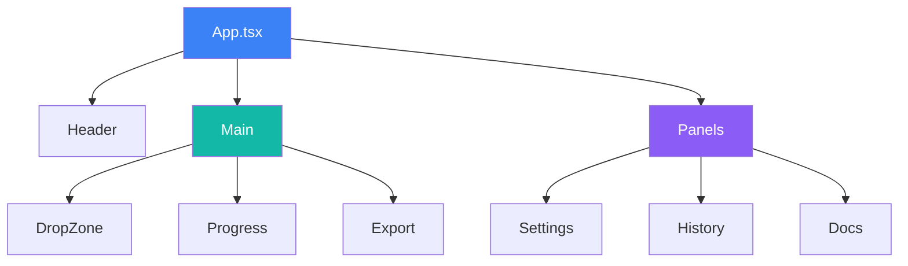
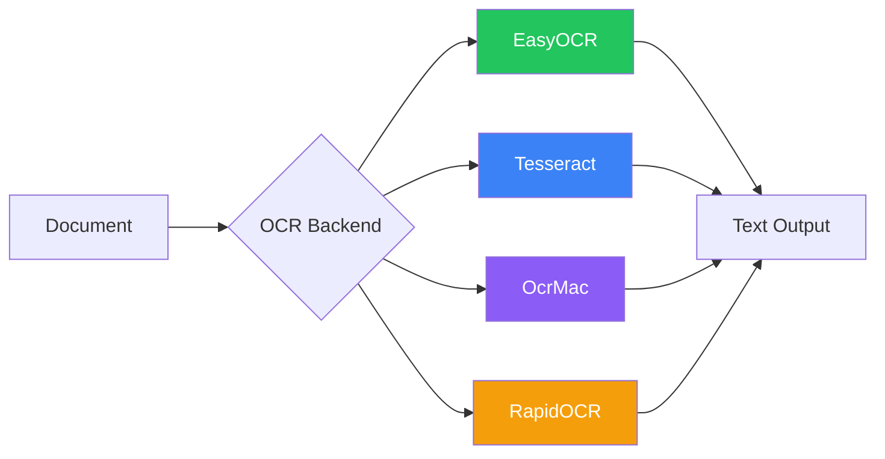
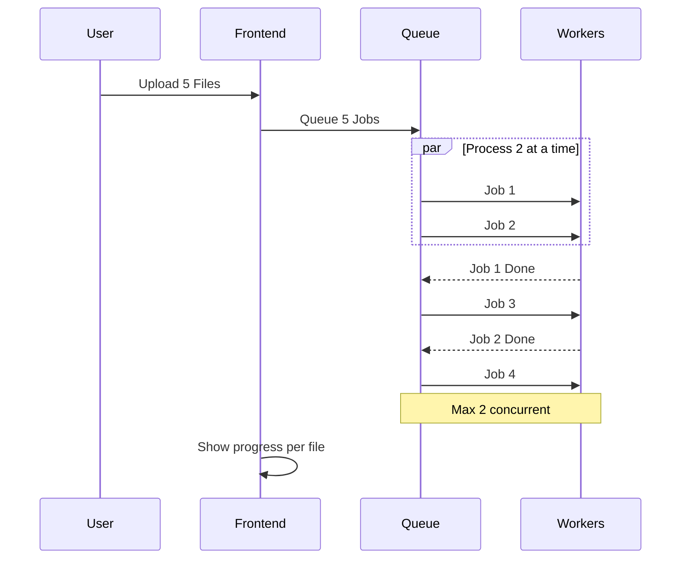

# Komponenten

Detaillierte Komponentendokumentation für Duckling.

## Frontend-Architektur

### Technologie-Stack

- **React 18** - UI-Framework mit funktionalen Komponenten und Hooks
- **TypeScript** - Typsicheres JavaScript
- **Tailwind CSS** - Utility-First CSS-Framework
- **Framer Motion** - Animationsbibliothek
- **React Query** - Server-State-Management
- **Axios** - HTTP-Client
- **Vite** - Build-Tool und Dev-Server

### Komponentenstruktur



### Komponentendateien

| Pfad | Beschreibung |
|------|--------------|
| `src/App.tsx` | Hauptanwendungskomponente |
| `src/main.tsx` | Anwendungseinstiegspunkt |
| `src/index.css` | Globale Styles |
| `src/components/DropZone.tsx` | Datei-Upload mit Drag-and-Drop |
| `src/components/ConversionProgress.tsx` | Fortschrittsanzeige |
| `src/components/ExportOptions.tsx` | Download und Vorschau der Ergebnisse |
| `src/components/SettingsPanel.tsx` | Konfigurationspanel |
| `src/components/HistoryPanel.tsx` | Konvertierungsverlauf |
| `src/components/DocsPanel.tsx` | Dokumentations-Viewer |
| `src/hooks/useConversion.ts` | Konvertierungsstatus und -aktionen |
| `src/hooks/useSettings.ts` | Einstellungs-State-Management |
| `src/services/api.ts` | API-Client-Funktionen |
| `src/types/index.ts` | TypeScript-Interfaces |

### State-Management

Die Anwendung verwendet eine Kombination aus:

1. **Lokaler State** - Komponentenebener State mit `useState`
2. **React Query** - Server-State-Caching und Synchronisation
3. **Benutzerdefinierte Hooks** - Eingekapselte Geschäftslogik

### Wichtige Hooks

#### `useConversion`

Verwaltet den Dokumentkonvertierungs-Workflow:

- Datei-Upload (einzeln und stapelweise)
- Status-Abfrage
- Ergebnisabruf
- Download-Handling

#### `useSettings`

Verwaltet Anwendungseinstellungen:

- OCR-, Tabellen-, Bild-, Leistungs- und Chunking-Einstellungen
- Einstellungspersistenz über API
- Einstellungsvalidierung

---

## Backend-Architektur

### Technologie-Stack

- **Flask** - Web-Framework
- **SQLAlchemy** - ORM für Datenbankoperationen
- **SQLite** - Eingebettete Datenbank für Verlauf
- **Docling** - Dokumentkonvertierungs-Engine
- **Threading** - Asynchrone Job-Verarbeitung

### Modulstruktur

| Pfad | Beschreibung |
|------|--------------|
| `backend/duckling.py` | Flask-Anwendungsfactory |
| `backend/config.py` | Konfiguration und Standardwerte |
| `backend/models/database.py` | SQLAlchemy-Modelle |
| `backend/routes/convert.py` | Konvertierungs-Endpoints |
| `backend/routes/settings.py` | Einstellungs-Endpoints |
| `backend/routes/history.py` | Verlaufs-Endpoints |
| `backend/services/converter.py` | Docling-Integration |
| `backend/services/file_manager.py` | Dateioperationen |
| `backend/services/history.py` | Verlaufs-CRUD |
| `backend/tests/` | Testsuite |

### Services

#### ConverterService

Behandelt Dokumentkonvertierung mit Docling:

```python
class ConverterService:
    def convert(self, file_path: str, settings: dict) -> ConversionResult:
        """Dokument mit den angegebenen Einstellungen konvertieren."""
        pass

    def get_status(self, job_id: str) -> JobStatus:
        """Status eines Konvertierungsjobs abrufen."""
        pass
```

#### FileManager

Verwaltet Datei-Uploads und -Ausgaben:

```python
class FileManager:
    def save_upload(self, file) -> str:
        """Hochgeladene Datei speichern und Pfad zurückgeben."""
        pass

    def get_output_path(self, job_id: str) -> str:
        """Ausgabeverzeichnis für einen Job abrufen."""
        pass
```

#### HistoryService

CRUD-Operationen für Konvertierungsverlauf:

```python
class HistoryService:
    def create(self, job_id: str, filename: str) -> Conversion:
        """Neuen Verlaufseintrag erstellen."""
        pass

    def update(self, job_id: str, **kwargs) -> Conversion:
        """Bestehenden Eintrag aktualisieren."""
        pass

    def get_stats(self) -> dict:
        """Konvertierungsstatistiken abrufen."""
        pass
```

---

## OCR-Integration

Docling unterstützt mehrere OCR-Backends:



| Backend | Beschreibung | GPU-Unterstützung |
|---------|-------------|-------------------|
| **EasyOCR** | Allzweck, mehrsprachig | Ja |
| **Tesseract** | Klassische OCR-Engine | Nein |
| **OcrMac** | macOS Vision Framework | Nein |
| **RapidOCR** | Schnell, ONNX-basiert | Nein |

Das Backend fällt automatisch auf Nicht-OCR-Verarbeitung zurück, wenn die OCR-Initialisierung fehlschlägt.

---

## Stapelverarbeitung



| Schritt | Beschreibung |
|---------|--------------|
| 1 | Frontend sendet POST /convert/batch mit mehreren Dateien |
| 2 | Backend speichert jede Datei, erstellt Jobs, reiht alle ein |
| 3 | Backend gibt 202 mit Array von Job-IDs zurück |
| 4 | Frontend fragt Status für jeden Job gleichzeitig ab |
| 5 | Backend verarbeitet max. 2 Jobs gleichzeitig, reiht Rest ein |
| 6 | Frontend zeigt Fortschritt pro Datei an |
