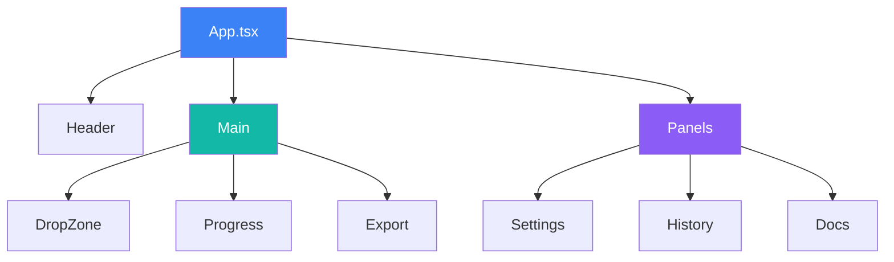
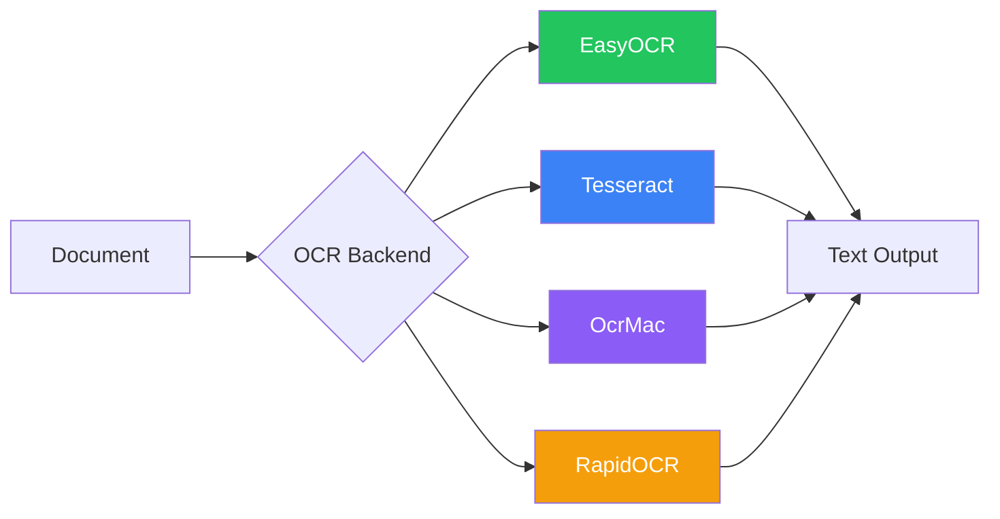
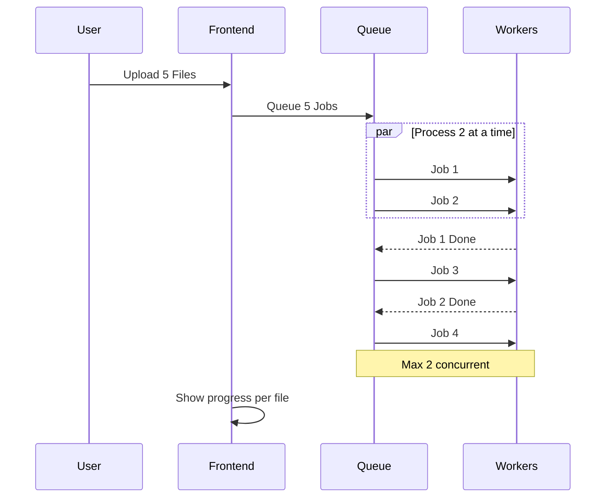

# Components

Detailed component documentation for Duckling.

## Frontend Architecture

### Technology Stack

- **React 18** - UI framework with functional components and hooks
- **TypeScript** - Type-safe JavaScript
- **Tailwind CSS** - Utility-first CSS framework
- **Framer Motion** - Animation library
- **React Query** - Server state management
- **Axios** - HTTP client
- **Vite** - Build tool and dev server

### Component Structure



### Component Files

| Path | Description |
|------|-------------|
| `src/App.tsx` | Main application component |
| `src/main.tsx` | Application entry point |
| `src/index.css` | Global styles |
| `src/components/DropZone.tsx` | File upload with drag-and-drop |
| `src/components/ConversionProgress.tsx` | Progress display |
| `src/components/ExportOptions.tsx` | Download and preview results |
| `src/components/SettingsPanel.tsx` | Configuration panel |
| `src/components/HistoryPanel.tsx` | Conversion history |
| `src/components/DocsPanel.tsx` | Documentation viewer |
| `src/hooks/useConversion.ts` | Conversion state and actions |
| `src/hooks/useSettings.ts` | Settings state management |
| `src/services/api.ts` | API client functions |
| `src/types/index.ts` | TypeScript interfaces |

### State Management

The application uses a combination of:

1. **Local State** - Component-level state with `useState`
2. **React Query** - Server state caching and synchronization
3. **Custom Hooks** - Encapsulated business logic

### Key Hooks

#### `useConversion`

Manages the document conversion workflow:

- File upload (single and batch)
- Status polling
- Result retrieval
- Download handling

#### `useSettings`

Manages application settings:

- OCR, table, image, performance, chunking settings
- Settings persistence via API
- Settings validation

---

## Backend Architecture

### Technology Stack

- **Flask** - Web framework
- **SQLAlchemy** - ORM for database operations
- **SQLite** - Embedded database for history
- **Docling** - Document conversion engine
- **Threading** - Async job processing

### Module Structure

| Path | Description |
|------|-------------|
| `backend/app.py` | Flask application factory |
| `backend/config.py` | Configuration and defaults |
| `backend/models/database.py` | SQLAlchemy models |
| `backend/routes/convert.py` | Conversion endpoints |
| `backend/routes/settings.py` | Settings endpoints |
| `backend/routes/history.py` | History endpoints |
| `backend/services/converter.py` | Docling integration |
| `backend/services/file_manager.py` | File operations |
| `backend/services/history.py` | History CRUD |
| `backend/tests/` | Test suite |

### Services

#### ConverterService

Handles document conversion using Docling:

```python
class ConverterService:
    def convert(self, file_path: str, settings: dict) -> ConversionResult:
        """Convert a document with the given settings."""
        pass

    def get_status(self, job_id: str) -> JobStatus:
        """Get the status of a conversion job."""
        pass
```

#### FileManager

Manages file uploads and outputs:

```python
class FileManager:
    def save_upload(self, file) -> str:
        """Save uploaded file and return path."""
        pass

    def get_output_path(self, job_id: str) -> str:
        """Get output directory for a job."""
        pass
```

#### HistoryService

CRUD operations for conversion history:

```python
class HistoryService:
    def create(self, job_id: str, filename: str) -> Conversion:
        """Create a new history entry."""
        pass

    def update(self, job_id: str, **kwargs) -> Conversion:
        """Update an existing entry."""
        pass

    def get_stats(self) -> dict:
        """Get conversion statistics."""
        pass
```

---

## OCR Integration

Docling supports multiple OCR backends:



| Backend | Description | GPU Support |
|---------|-------------|-------------|
| **EasyOCR** | General-purpose, multi-language | Yes |
| **Tesseract** | Classic OCR engine | No |
| **OcrMac** | macOS Vision framework | No |
| **RapidOCR** | Fast ONNX-based | No |

The backend automatically falls back to non-OCR processing if OCR initialization fails.

---

## Batch Processing



| Step | Description |
|------|-------------|
| 1 | Frontend sends POST /convert/batch with multiple files |
| 2 | Backend saves each file, creates jobs, queues all |
| 3 | Backend returns 202 with array of job IDs |
| 4 | Frontend polls status for each job simultaneously |
| 5 | Backend processes max 2 jobs at a time, queues rest |
| 6 | Frontend displays per-file progress |

