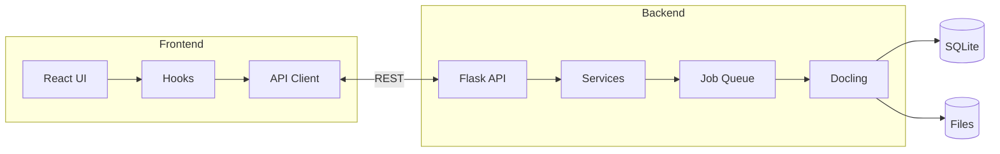
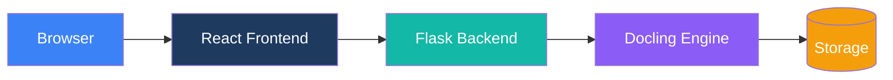
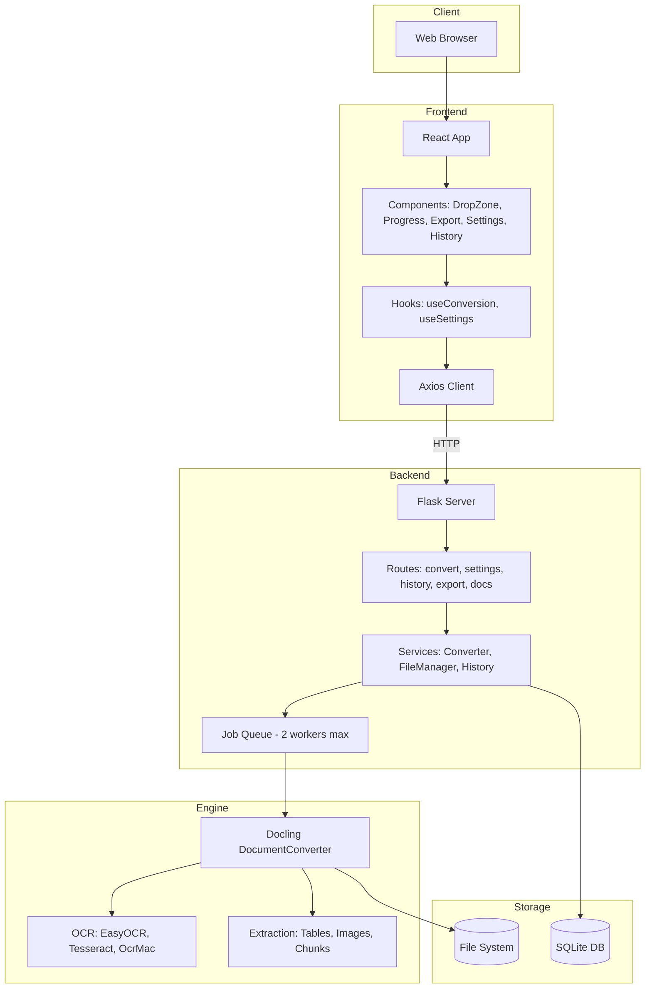
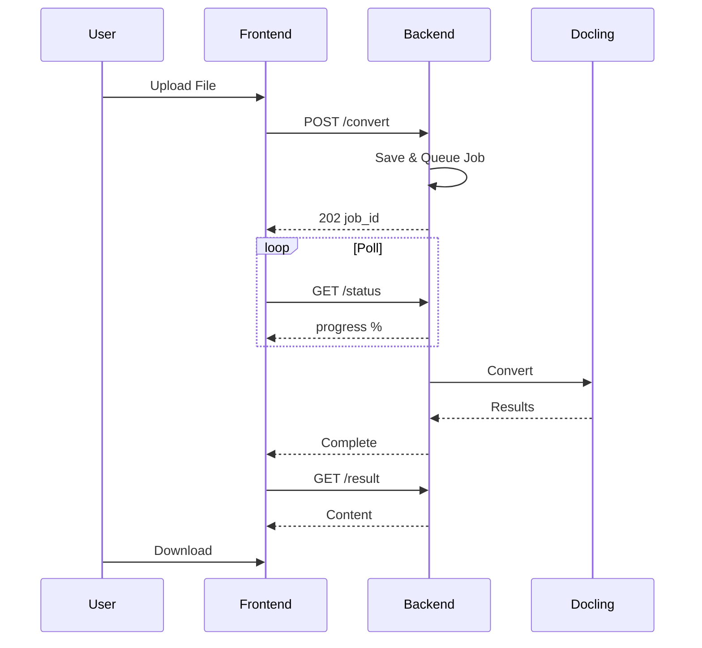
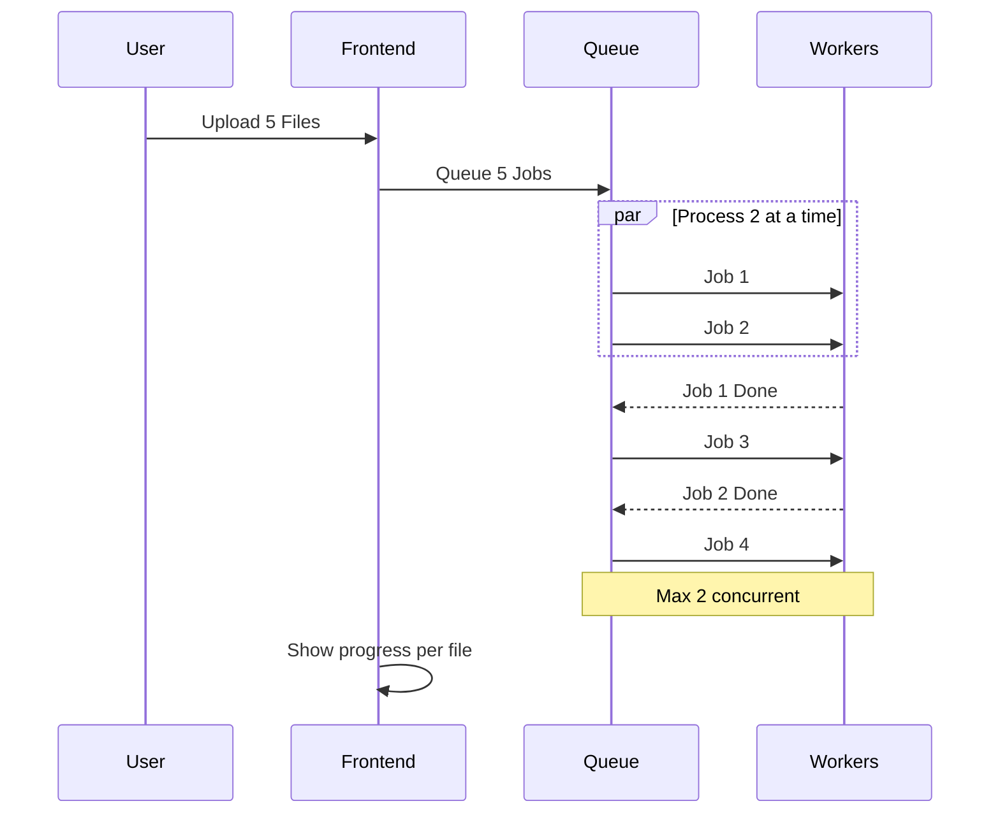
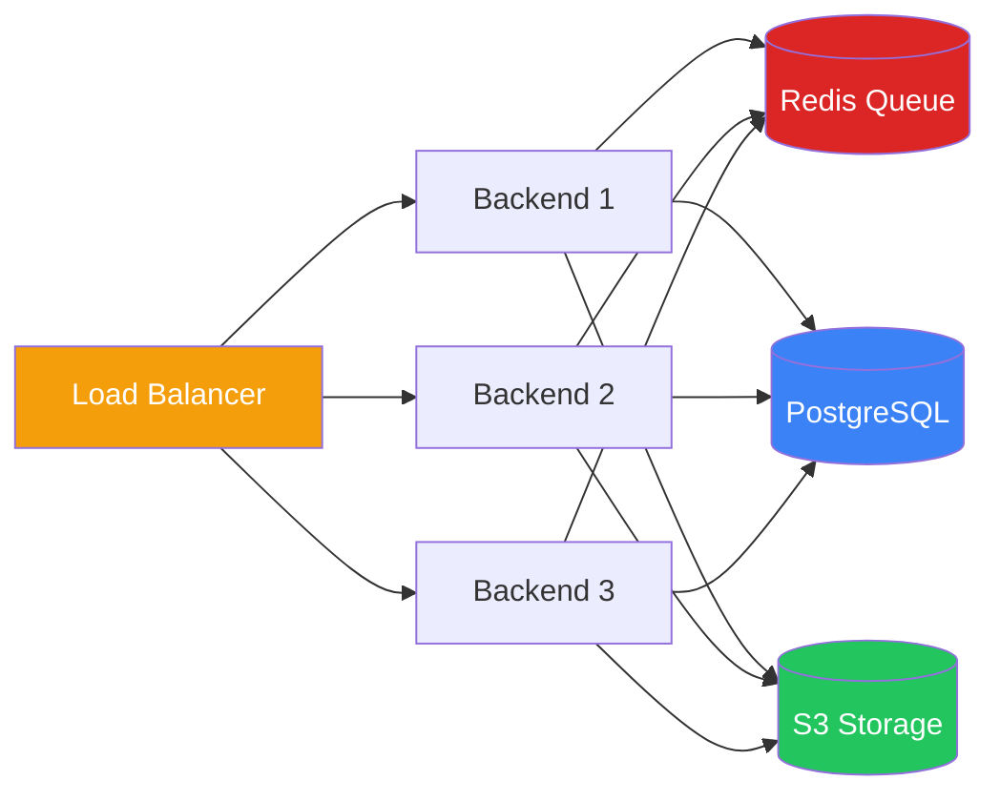
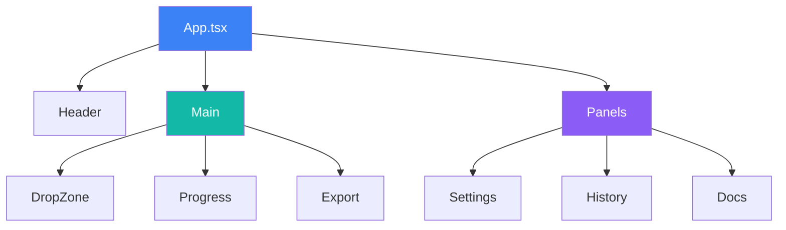
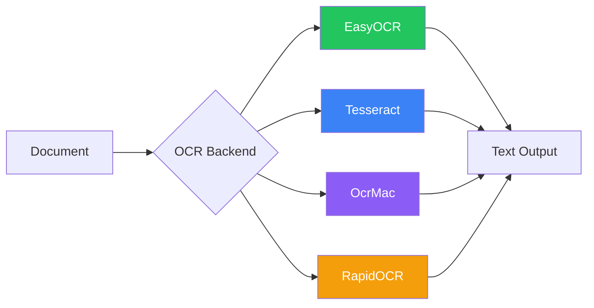

# Architekturdiagramme

Visuelle Diagramme für die Duckling-Architektur.

## Systemarchitektur-Übersicht

---

## Einfache Architektur

---

## Detaillierte Schichtenansicht

---

## Konvertierungs-Fluss

---

## Stapelverarbeitung

---

## Skalierungsarchitektur

Für Produktionsbereitstellungen mit hohem Verkehrsaufkommen:

---

## Komponentenbaum

---

## OCR-Optionen

---

## Statische Diagrammbilder

Für Umgebungen, die Mermaid-Rendering nicht unterstützen, sind statische Bilder verfügbar:

- [Systemarchitektur](../arch.png)
- [Detaillierte Schichtenansicht](../Detailed-Layer-View.png)
- [Konvertierungspipeline](../ConversionPipeline.png)
- [Stapelverarbeitung](../BatchProcessing.png)
- [Skalierungsarchitektur](../ScalingArchitecture.png)
- [Komponentenbaum](../ComponentTree.png)
- [OCR-Optionen](../OCR.png)
