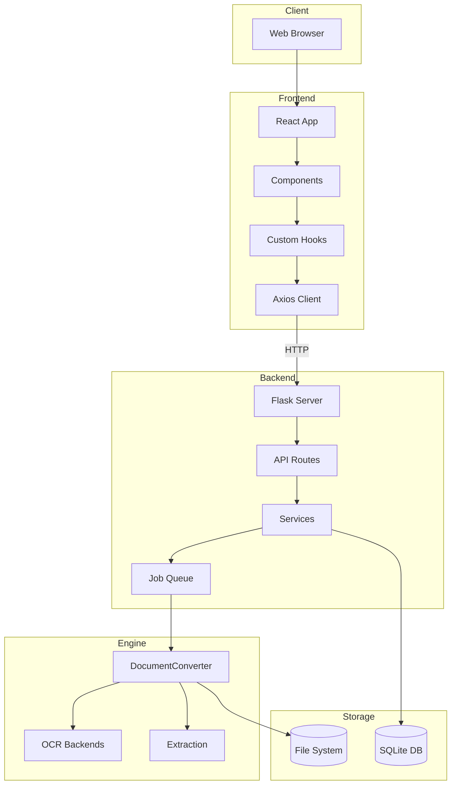
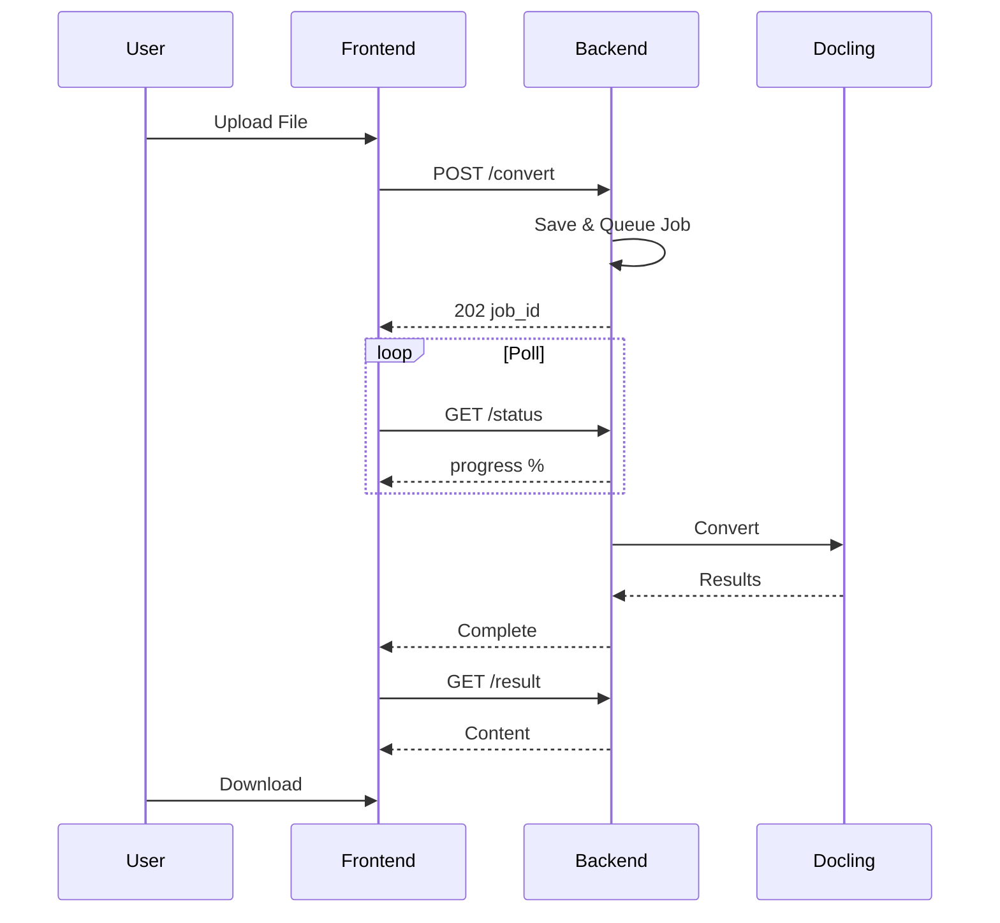

# Systemübersicht

High-Level-Architektur und Datenfluss in Duckling.

## Architekturdiagramm


## Detaillierte Schichtenansicht



## Datenfluss

### Dokumentkonvertierungs-Fluss



### Konvertierungspipeline

| Schritt | Beschreibung |
|---------|--------------|
| 1 | **Upload-Anfrage** - Datei über POST empfangen |
| 2 | **Dateivalidierung & -speicherung** - Erweiterung prüfen, in uploads/ speichern |
| 3 | **Job-Erstellung** - UUID zugewiesen, Eintrag erstellt |
| 4 | **Zur Verarbeitung in Warteschlange** - Zur Job-Warteschlange hinzugefügt |
| 5 | **Worker-Thread übernimmt Job** - Wenn Kapazität verfügbar |
| 6 | **DocumentConverter initialisiert** - Mit OCR-, Tabellen-, Bildeinstellungen |
| 7 | **Dokumentkonvertierung** - Bilder, Tabellen, Chunks extrahieren |
| 8 | **Export in Formate** - MD, HTML, JSON, TXT, DocTags, Tokens |
| 9 | **Job-Status & Verlauf aktualisieren** - Als abgeschlossen markieren, Metadaten speichern |
| 10 | **Ergebnisse verfügbar** - Bereit zum Download |

## Job-Warteschlangen-System

Um Speichererschöpfung bei der Verarbeitung mehrerer Dokumente zu verhindern:

```python
class ConverterService:
    _job_queue: Queue       # Ausstehende Jobs
    _worker_thread: Thread  # Hintergrundprozessor
    _max_concurrent_jobs = 2  # Parallele Verarbeitung begrenzen
```

Der Worker-Thread:

1. Überwacht die Job-Warteschlange
2. Startet Konvertierungs-Threads bis zur gleichzeitigen Grenze
3. Verfolgt aktive Threads und bereinigt abgeschlossene
4. Verhindert Ressourcenerschöpfung während Stapelverarbeitung

## Datenbankschema

### Konvertierungs-Tabelle

| Spalte | Typ | Beschreibung |
|--------|-----|--------------|
| `id` | VARCHAR(36) | Primärschlüssel (UUID) |
| `filename` | VARCHAR(255) | Bereinigter Dateiname |
| `original_filename` | VARCHAR(255) | Originaler Upload-Name |
| `input_format` | VARCHAR(50) | Erkanntes Format |
| `status` | VARCHAR(50) | pending/processing/completed/failed |
| `confidence` | FLOAT | OCR-Konfidenz-Score |
| `error_message` | TEXT | Fehlerdetails bei Fehlschlag |
| `output_path` | VARCHAR(500) | Pfad zu Ausgabedateien |
| `settings` | TEXT | Verwendete JSON-Einstellungen |
| `file_size` | FLOAT | Dateigröße in Bytes |
| `created_at` | DATETIME | Upload-Zeitstempel |
| `completed_at` | DATETIME | Abschluss-Zeitstempel |

## Sicherheitsüberlegungen

| Anliegen | Minderung |
|----------|----------|
| **Datei-Upload** | Nur erlaubte Erweiterungen akzeptiert |
| **Dateigröße** | Konfigurierbares Maximum (Standard 100MB) |
| **Dateinamen** | Vor Speicherung bereinigt |
| **Dateizugriff** | Nur über API bereitgestellt, keine direkten Pfade |
| **CORS** | Auf Frontend-Herkunft beschränkt |

## Leistungsoptimierungen

| Optimierung | Beschreibung |
|-------------|--------------|
| **Converter-Caching** | DocumentConverter-Instanzen nach Einstellungs-Hash gecacht |
| **Job-Warteschlange** | Sequenzielle Verarbeitung verhindert Speichererschöpfung |
| **Lazy Loading** | Schwere Komponenten bei Bedarf geladen |
| **React Query-Caching** | API-Antworten gecacht und dedupliziert |
| **Hintergrundverarbeitung** | Konvertierungen blockieren die API nicht |
