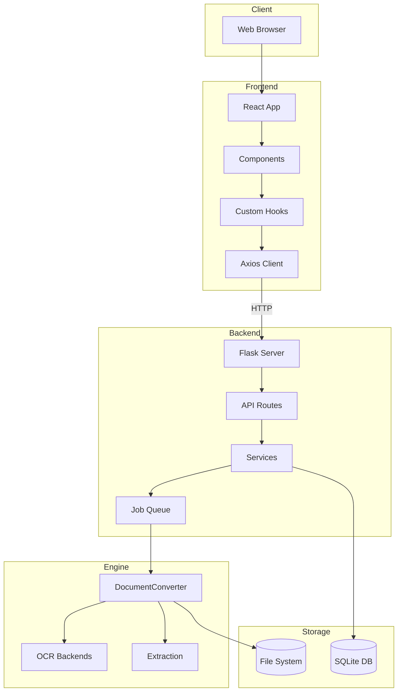
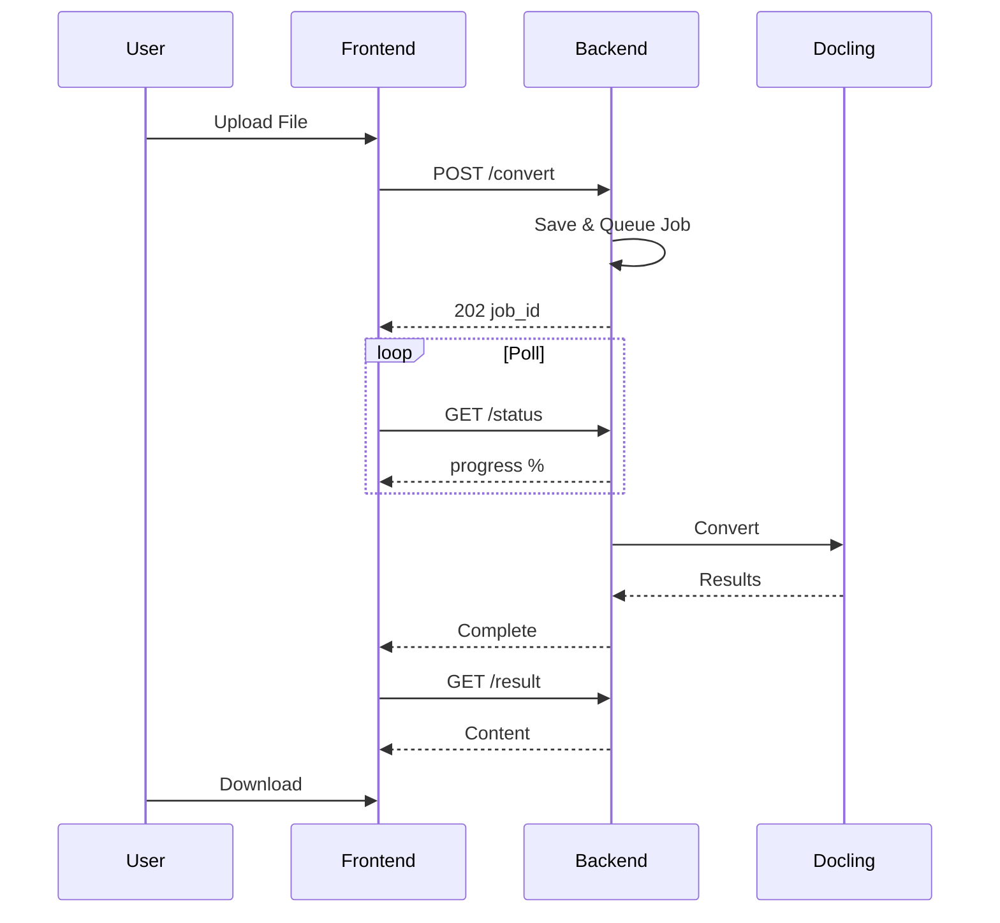

# System Overview

High-level architecture and data flow in Duckling.

## Architecture Diagram


## Detailed Layer View



## Data Flow

### Document Conversion Flow



### Conversion Pipeline

| Step | Description |
|------|-------------|
| 1 | **Upload Request** - File received via POST |
| 2 | **File Validation & Storage** - Check extension, save to uploads/ |
| 3 | **Job Creation** - UUID assigned, entry created |
| 4 | **Queue for Processing** - Added to job queue |
| 5 | **Worker Thread Picks Up Job** - When capacity available |
| 6 | **DocumentConverter Initialized** - With OCR, table, image settings |
| 7 | **Document Conversion** - Extract images, tables, chunks |
| 8 | **Export to Formats** - MD, HTML, JSON, TXT, DocTags, Tokens |
| 9 | **Update Job Status & History** - Mark complete, store metadata |
| 10 | **Results Available** - Ready for download |

## Job Queue System

To prevent memory exhaustion when processing multiple documents:

```python
class ConverterService:
    _job_queue: Queue       # Pending jobs
    _worker_thread: Thread  # Background processor
    _max_concurrent_jobs = 2  # Limit parallel processing
```

The worker thread:

1. Monitors the job queue
2. Starts conversion threads up to the concurrent limit
3. Tracks active threads and cleans up completed ones
4. Prevents resource exhaustion during batch processing

## Database Schema

### Conversion Table

| Column | Type | Description |
|--------|------|-------------|
| `id` | VARCHAR(36) | Primary key (UUID) |
| `filename` | VARCHAR(255) | Sanitized filename |
| `original_filename` | VARCHAR(255) | Original upload name |
| `input_format` | VARCHAR(50) | Detected format |
| `status` | VARCHAR(50) | pending/processing/completed/failed |
| `confidence` | FLOAT | OCR confidence score |
| `error_message` | TEXT | Error details if failed |
| `output_path` | VARCHAR(500) | Path to output files |
| `settings` | TEXT | JSON settings used |
| `file_size` | FLOAT | File size in bytes |
| `created_at` | DATETIME | Upload timestamp |
| `completed_at` | DATETIME | Completion timestamp |

## Security Considerations

| Concern | Mitigation |
|---------|------------|
| **File Upload** | Only allowed extensions accepted |
| **File Size** | Configurable max (default 100MB) |
| **Filenames** | Sanitized before storage |
| **File Access** | Served through API only, no direct paths |
| **CORS** | Restricted to frontend origin |

## Performance Optimizations

| Optimization | Description |
|--------------|-------------|
| **Converter Caching** | DocumentConverter instances cached by settings hash |
| **Job Queue** | Sequential processing prevents memory exhaustion |
| **Lazy Loading** | Heavy components loaded on demand |
| **React Query Caching** | API responses cached and deduplicated |
| **Background Processing** | Conversions don't block the API |

