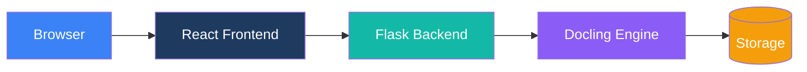

# Duckling

Eine moderne, benutzerfreundliche grafische Oberfläche für [Docling](https://github.com/docling-project/docling) – die leistungsstarke Dokumentkonvertierungsbibliothek von IBM.


## Überblick

Duckling bietet eine intuitive Web-Oberfläche zur Konvertierung von Dokumenten mit IBMs Docling-Bibliothek. Ob Sie Text aus PDFs extrahieren, Word-Dokumente nach Markdown konvertieren oder OCR für gescannte Bilder durchführen möchten – Duckling macht es einfach.

## Hauptfunktionen

<div class="grid cards" markdown>

-   :material-cursor-move:{ .lg .middle } __Drag-and-Drop-Upload__

    ---

    Ziehen Sie Ihre Dokumente einfach auf die Oberfläche für sofortige Verarbeitung

-   :material-file-multiple:{ .lg .middle } __Stapelverarbeitung__

    ---

    Konvertieren Sie mehrere Dateien gleichzeitig mit paralleler Verarbeitung

-   :material-format-list-bulleted:{ .lg .middle } __Multi-Format-Unterstützung__

    ---

    PDFs, Word-Dokumente, PowerPoints, Excel-Dateien, HTML, Markdown, Bilder und mehr

-   :material-export:{ .lg .middle } __Mehrere Exportformate__

    ---

    Exportieren Sie nach Markdown, HTML, JSON, DocTags, Document Tokens, RAG Chunks oder Klartext

-   :material-image-multiple:{ .lg .middle } __Bild- und Tabellenextraktion__

    ---

    Extrahieren Sie eingebettete Bilder und Tabellen mit CSV-Export

-   :material-puzzle:{ .lg .middle } __RAG-optimiertes Chunking__

    ---

    Generieren Sie Dokument-Segmente, die für RAG-Anwendungen optimiert sind

-   :material-eye:{ .lg .middle } __Erweiterte OCR__

    ---

    Mehrere OCR-Backends mit GPU-Beschleunigungsunterstützung

-   :material-history:{ .lg .middle } __Konvertierungsverlauf__

    ---

    Greifen Sie jederzeit auf zuvor konvertierte Dokumente zu

</div>

## Schnellstart

Starten Sie in wenigen Minuten:

=== "Docker (Empfohlen)"

    **Ein-Befehl-Start mit vorgefertigten Images:**
    ```bash
    curl -O https://raw.githubusercontent.com/davidgs/duckling/main/docker-compose.prebuilt.yml && docker-compose -f docker-compose.prebuilt.yml up -d
    ```

    **Oder lokal erstellen:**
    ```bash
    git clone https://github.com/davidgs/duckling.git
    cd duckling
    docker-compose up --build
    ```

=== "Lokale Entwicklung"

    ```bash
    # Repository klonen
    git clone https://github.com/davidgs/duckling.git
    cd duckling

    # Backend-Einrichtung
    cd backend
    python -m venv venv
    source venv/bin/activate
    pip install -r requirements.txt
    python duckling.py

    # Frontend-Einrichtung (neues Terminal)
    cd frontend
    npm install
    npm run dev
    ```

Greifen Sie auf die Anwendung unter `http://localhost:3000` zu

## Unterstützte Formate

### Eingabeformate

| Format | Erweiterungen | Beschreibung |
|--------|---------------|--------------|
| PDF | `.pdf` | Portable Document Format |
| Word | `.docx` | Microsoft Word-Dokumente |
| PowerPoint | `.pptx` | Microsoft PowerPoint-Präsentationen |
| Excel | `.xlsx` | Microsoft Excel-Tabellenkalkulationen |
| HTML | `.html`, `.htm` | Webseiten |
| Markdown | `.md`, `.markdown` | Markdown-Dateien |
| Bilder | `.png`, `.jpg`, `.jpeg`, `.tiff`, `.gif`, `.webp`, `.bmp` | Direkte Bild-OCR |
| AsciiDoc | `.asciidoc`, `.adoc` | Technische Dokumentation |
| PubMed XML | `.xml` | Wissenschaftliche Artikel |
| USPTO XML | `.xml` | Patentdokumente |

### Exportformate

| Format | Erweiterung | Beschreibung |
|--------|-------------|--------------|
| Markdown | `.md` | Formatierter Text mit Überschriften, Listen, Links |
| HTML | `.html` | Web-fertiges Format mit Styling |
| JSON | `.json` | Vollständige Dokumentstruktur |
| Klartext | `.txt` | Einfacher Text ohne Formatierung |
| DocTags | `.doctags` | Markiertes Dokumentformat |
| Document Tokens | `.tokens.json` | Token-Ebene-Darstellung |
| RAG Chunks | `.chunks.json` | Chunks für RAG-Anwendungen |

## Architektur



## Dokumentation

- **[Erste Schritte](getting-started/index.md)** - Installations- und Schnellstartanleitung
- **[Benutzerhandbuch](user-guide/index.md)** - Funktionen und Konfigurationsoptionen
- **[API-Referenz](api/index.md)** - Vollständige API-Dokumentation
- **[Architektur](architecture/index.md)** - Systemdesign und Komponenten
- **[Bereitstellung](deployment/index.md)** - Produktionsbereitstellungsanleitung
- **[Mitwirken](contributing/index.md)** - Wie man beiträgt## Danksagungen- [Docling](https://github.com/docling-project/docling) von IBM für die leistungsstarke Dokumentkonvertierungs-Engine
- [React](https://react.dev/) für das Frontend-Framework
- [Flask](https://flask.palletsprojects.com/) für das Backend-Framework
- [Tailwind CSS](https://tailwindcss.com/) für das Styling
- [Framer Motion](https://www.framer.com/motion/) für Animationen
