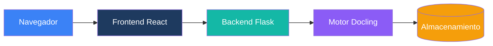

# Arquitectura

Documentación técnica de la arquitectura de Duckling.

## Visión General

Duckling es una aplicación web full-stack con una clara separación entre frontend y backend:

## Secciones

-   :material-view-dashboard:{ .lg .middle } __Vista General del Sistema__

    ---

    Arquitectura de alto nivel y flujo de datos

    [:octicons-arrow-right-24: Vista General](overview.md)

-   :material-puzzle:{ .lg .middle } __Componentes__

    ---

    Detalles de componentes frontend y backend

    [:octicons-arrow-right-24: Componentes](components.md)

-   :material-chart-box:{ .lg .middle } __Diagramas__

    ---

    Diagramas de arquitectura y diagramas de flujo

    [:octicons-arrow-right-24: Diagramas](diagrams.md)

## Decisiones de Diseño Clave

### Separación de Responsabilidades

- **Frontend**: React con TypeScript para seguridad de tipos e interfaz moderna
- **Backend**: Flask por simplicidad y acceso al ecosistema Python
- **Motor**: Docling para conversión de documentos (biblioteca de IBM)

### Procesamiento Asíncrono

La conversión de documentos se maneja de forma asíncrona:

1. El cliente sube el archivo
2. El servidor devuelve un ID de trabajo inmediatamente
3. El cliente consulta el estado
4. El servidor procesa en un hilo en segundo plano
5. Los resultados están disponibles cuando se completa

### Cola de Trabajos

Una cola de trabajos basada en hilos previene el agotamiento de memoria:

- Máximo 2 conversiones simultáneas
- Los trabajos se ponen en cola cuando se alcanza la capacidad
- Limpieza automática de trabajos completados

### Persistencia de Configuración

Los ajustes se almacenan por sesión de usuario y se aplican por conversión:

- Valores predeterminados globales en `config.py`
- Configuración de usuario almacenada en la base de datos (por ID de sesión)
- Anulaciones por solicitud a través de la API

Los ajustes están aislados por sesión de usuario, garantizando que los despliegues multi-usuario no interfieran con las preferencias de otros.

## Stack Tecnológico

### Frontend

| Tecnología | Propósito |
|------------|-----------|
| React 18 | Framework de UI |
| TypeScript | Seguridad de tipos |
| Tailwind CSS | Estilos |
| Framer Motion | Animaciones |
| Axios | Cliente HTTP |
| Vite | Herramienta de construcción |

### Backend

| Tecnología | Propósito |
|------------|-----------|
| Flask | Framework web |
| SQLAlchemy | ORM de base de datos |
| SQLite | Almacenamiento de historial |
| Docling | Conversión de documentos |
| Threading | Procesamiento asíncrono |
