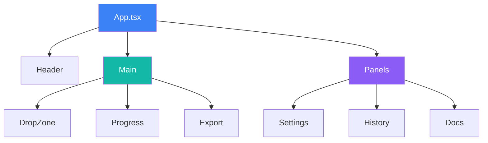
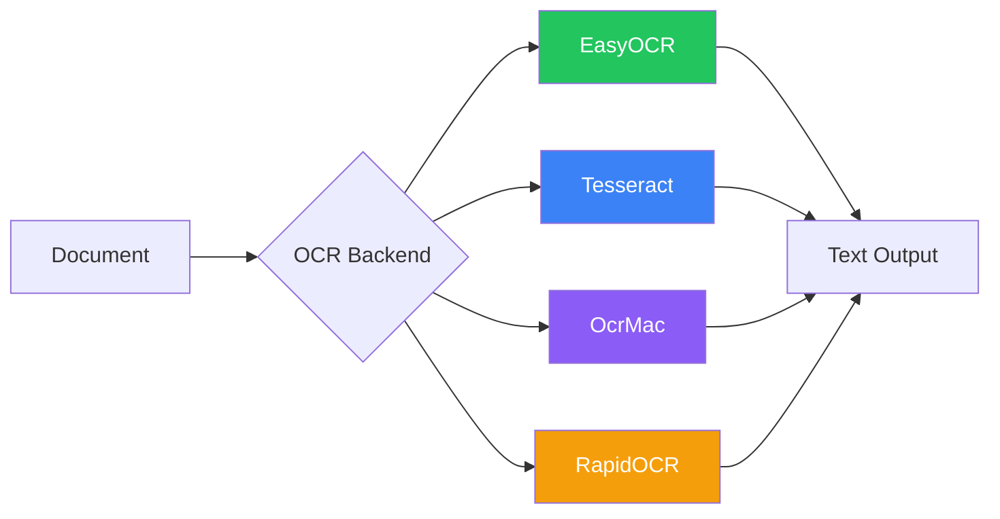
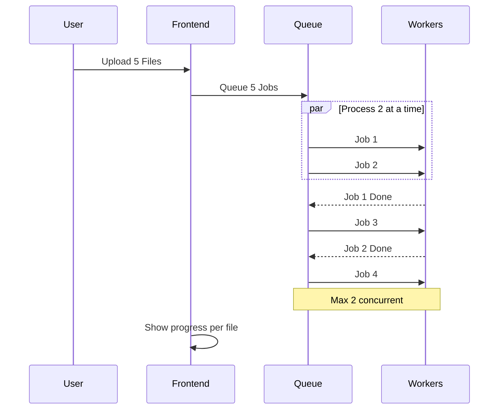

# Composants

Documentation détaillée des composants pour Duckling.

## Architecture frontend

### Pile technologique

- **React 18** - Framework UI avec composants fonctionnels et hooks
- **TypeScript** - JavaScript typé
- **Tailwind CSS** - Framework CSS utilitaire
- **Framer Motion** - Bibliothèque d'animation
- **React Query** - Gestion d'état serveur
- **Axios** - Client HTTP
- **Vite** - Outil de build et serveur de développement

### Structure des composants



### Fichiers de composants

| Chemin | Description |
|--------|-------------|
| `src/App.tsx` | Composant principal de l'application |
| `src/main.tsx` | Point d'entrée de l'application |
| `src/index.css` | Styles globaux |
| `src/components/DropZone.tsx` | Téléversement de fichiers avec glisser-déposer |
| `src/components/ConversionProgress.tsx` | Affichage de la progression |
| `src/components/ExportOptions.tsx` | Téléchargement et aperçu des résultats |
| `src/components/SettingsPanel.tsx` | Panneau de configuration |
| `src/components/HistoryPanel.tsx` | Historique des conversions |
| `src/components/DocsPanel.tsx` | Visualiseur de documentation |
| `src/hooks/useConversion.ts` | État et actions de conversion |
| `src/hooks/useSettings.ts` | Gestion d'état des paramètres |
| `src/services/api.ts` | Fonctions client API |
| `src/types/index.ts` | Interfaces TypeScript |

### Gestion d'état

L'application utilise une combinaison de :

1. **État local** - État au niveau du composant avec `useState`
2. **React Query** - Mise en cache et synchronisation de l'état serveur
3. **Hooks personnalisés** - Logique métier encapsulée

### Hooks principaux

#### `useConversion`

Gère le flux de travail de conversion de documents :

- Téléversement de fichiers (unique et lot)
- Interrogation du statut
- Récupération des résultats
- Gestion des téléchargements

#### `useSettings`

Gère les paramètres de l'application :

- Paramètres OCR, tableaux, images, performance, segmentation
- Persistance des paramètres via l'API
- Validation des paramètres

---

## Architecture backend

### Pile technologique

- **Flask** - Framework web
- **SQLAlchemy** - ORM pour les opérations de base de données
- **SQLite** - Base de données embarquée pour l'historique
- **Docling** - Moteur de conversion de documents
- **Threading** - Traitement de jobs asynchrone

### Structure des modules

| Chemin | Description |
|--------|-------------|
| `backend/duckling.py` | Factory d'application Flask |
| `backend/config.py` | Configuration et valeurs par défaut |
| `backend/models/database.py` | Modèles SQLAlchemy |
| `backend/routes/convert.py` | Endpoints de conversion |
| `backend/routes/settings.py` | Endpoints de paramètres |
| `backend/routes/history.py` | Endpoints d'historique |
| `backend/services/converter.py` | Intégration Docling |
| `backend/services/file_manager.py` | Opérations sur fichiers |
| `backend/services/history.py` | CRUD d'historique |
| `backend/tests/` | Suite de tests |

### Services

#### ConverterService

Gère la conversion de documents avec Docling :

```python
class ConverterService:
    def convert(self, file_path: str, settings: dict) -> ConversionResult:
        """Convertir un document avec les paramètres donnés."""
        pass

    def get_status(self, job_id: str) -> JobStatus:
        """Obtenir le statut d'un job de conversion."""
        pass
```

#### FileManager

Gère les téléversements et sorties de fichiers :

```python
class FileManager:
    def save_upload(self, file) -> str:
        """Enregistrer le fichier téléversé et retourner le chemin."""
        pass

    def get_output_path(self, job_id: str) -> str:
        """Obtenir le répertoire de sortie pour un job."""
        pass
```

#### HistoryService

Opérations CRUD pour l'historique des conversions :

```python
class HistoryService:
    def create(self, job_id: str, filename: str) -> Conversion:
        """Créer une nouvelle entrée d'historique."""
        pass

    def update(self, job_id: str, **kwargs) -> Conversion:
        """Mettre à jour une entrée existante."""
        pass

    def get_stats(self) -> dict:
        """Obtenir les statistiques de conversion."""
        pass
```

---

## Intégration OCR

Docling prend en charge plusieurs backends OCR :



| Backend | Description | Support GPU |
|---------|-------------|--------------|
| **EasyOCR** | Polyvalent, multilingue | Oui |
| **Tesseract** | Moteur OCR classique | Non |
| **OcrMac** | Framework Vision macOS | Non |
| **RapidOCR** | Rapide basé sur ONNX | Non |

Le backend bascule automatiquement vers un traitement non-OCR si l'initialisation OCR échoue.

---

## Traitement par lot



| Étape | Description |
|-------|-------------|
| 1 | Le frontend envoie POST /convert/batch avec plusieurs fichiers |
| 2 | Le backend enregistre chaque fichier, crée des jobs, met tout en file d'attente |
| 3 | Le backend retourne 202 avec un tableau d'IDs de jobs |
| 4 | Le frontend interroge le statut pour chaque job simultanément |
| 5 | Le backend traite max 2 jobs à la fois, met le reste en file d'attente |
| 6 | Le frontend affiche la progression par fichier |
