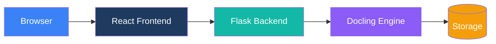

# Architecture

Documentation technique de l'architecture de Duckling.

## Aperçu

Duckling est une application web full-stack avec une séparation claire entre frontend et backend :

## Sections

-   :material-view-dashboard:{ .lg .middle } __Vue d'ensemble du système__

    ---

    Architecture de haut niveau et flux de données

    [:octicons-arrow-right-24: Vue d'ensemble](overview.md)

-   :material-puzzle:{ .lg .middle } __Composants__

    ---

    Détails des composants frontend et backend

    [:octicons-arrow-right-24: Composants](components.md)

-   :material-chart-box:{ .lg .middle } __Diagrammes__

    ---

    Diagrammes d'architecture et organigrammes

    [:octicons-arrow-right-24: Diagrammes](diagrams.md)

## Décisions de conception clés

### Séparation des préoccupations

- **Frontend** : React avec TypeScript pour la sécurité de type et l'UI moderne
- **Backend** : Flask pour la simplicité et l'accès à l'écosystème Python
- **Moteur** : Docling pour la conversion de documents (bibliothèque d'IBM)

### Traitement asynchrone

La conversion de documents est gérée de manière asynchrone :

1. Le client téléverse un fichier
2. Le serveur retourne immédiatement un ID de job
3. Le client interroge le statut
4. Le serveur traite dans un thread en arrière-plan
5. Les résultats sont disponibles une fois terminés

### File d'attente de jobs

Une file d'attente basée sur les threads empêche l'épuisement de la mémoire :

- Maximum 2 conversions simultanées
- Jobs mis en file d'attente lorsque la capacité est atteinte
- Nettoyage automatique des jobs terminés

### Persistance des paramètres

Les paramètres sont stockés par session utilisateur et appliqués par conversion :

- Valeurs par défaut globales dans `config.py`
- Paramètres utilisateur stockés dans la base de données (par ID de session)
- Remplacements par requête via l'API

Les paramètres sont isolés par session utilisateur, garantissant que les déploiements multi-utilisateurs n'interfèrent pas avec les préférences des autres.

## Pile technologique

### Frontend

| Technologie | Objectif |
|------------|----------|
| React 18 | Framework UI |
| TypeScript | Sécurité de type |
| Tailwind CSS | Styles |
| Framer Motion | Animations |
| Axios | Client HTTP |
| Vite | Outil de build |

### Backend

| Technologie | Objectif |
|------------|----------|
| Flask | Framework web |
| SQLAlchemy | ORM de base de données |
| SQLite | Stockage de l'historique |
| Docling | Conversion de documents |
| Threading | Traitement asynchrone |
