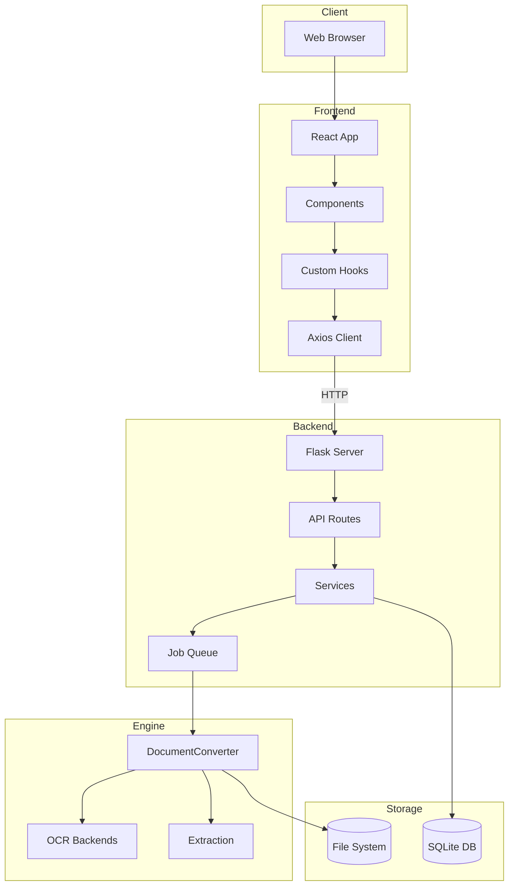
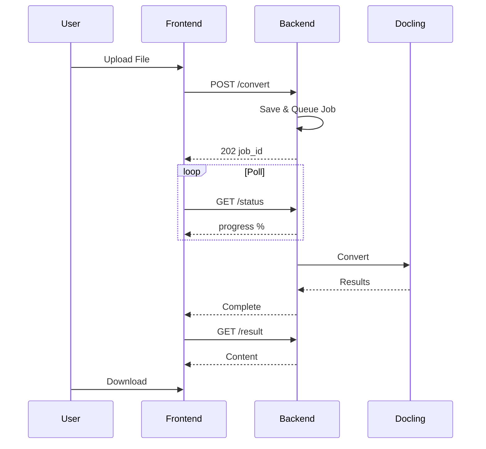

# Vue d'ensemble du système

Architecture de haut niveau et flux de données dans Duckling.

## Diagramme d'architecture


## Vue détaillée des couches



## Flux de données

### Flux de conversion de document



### Pipeline de conversion

| Étape | Description |
|-------|-------------|
| 1 | **Requête de téléversement** - Fichier reçu via POST |
| 2 | **Validation et stockage du fichier** - Vérifier l'extension, enregistrer dans uploads/ |
| 3 | **Création du job** - UUID assigné, entrée créée |
| 4 | **Mise en file d'attente pour traitement** - Ajouté à la file d'attente |
| 5 | **Thread worker récupère le job** - Lorsque la capacité est disponible |
| 6 | **DocumentConverter initialisé** - Avec paramètres OCR, tableaux, images |
| 7 | **Conversion du document** - Extraire images, tableaux, segments |
| 8 | **Export vers formats** - MD, HTML, JSON, TXT, DocTags, Tokens |
| 9 | **Mise à jour du statut et historique** - Marquer comme terminé, stocker les métadonnées |
| 10 | **Résultats disponibles** - Prêts pour téléchargement |

## Système de file d'attente de jobs

Pour éviter l'épuisement de la mémoire lors du traitement de plusieurs documents :

```python
class ConverterService:
    _job_queue: Queue       # Jobs en attente
    _worker_thread: Thread  # Processeur en arrière-plan
    _max_concurrent_jobs = 2  # Limiter le traitement parallèle
```

Le thread worker :

1. Surveille la file d'attente
2. Démarre les threads de conversion jusqu'à la limite concurrente
3. Suit les threads actifs et nettoie ceux terminés
4. Empêche l'épuisement des ressources pendant le traitement par lot

## Schéma de base de données

### Table Conversion

| Colonne | Type | Description |
|--------|------|-------------|
| `id` | VARCHAR(36) | Clé primaire (UUID) |
| `filename` | VARCHAR(255) | Nom de fichier nettoyé |
| `original_filename` | VARCHAR(255) | Nom de téléversement original |
| `input_format` | VARCHAR(50) | Format détecté |
| `status` | VARCHAR(50) | pending/processing/completed/failed |
| `confidence` | FLOAT | Score de confiance OCR |
| `error_message` | TEXT | Détails d'erreur si échec |
| `output_path` | VARCHAR(500) | Chemin vers les fichiers de sortie |
| `settings` | TEXT | Paramètres JSON utilisés |
| `file_size` | FLOAT | Taille du fichier en octets |
| `created_at` | DATETIME | Horodatage de téléversement |
| `completed_at` | DATETIME | Horodatage de fin |

## Considérations de sécurité

| Préoccupation | Atténuation |
|----------------|-------------|
| **Téléversement de fichiers** | Seules les extensions autorisées acceptées |
| **Taille de fichier** | Maximum configurable (par défaut 100MB) |
| **Noms de fichiers** | Nettoyés avant stockage |
| **Accès aux fichiers** | Servis uniquement via l'API, pas de chemins directs |
| **CORS** | Restreint à l'origine du frontend |

## Optimisations de performance

| Optimisation | Description |
|--------------|-------------|
| **Mise en cache du convertisseur** | Instances DocumentConverter mises en cache par hash de paramètres |
| **File d'attente de jobs** | Traitement séquentiel empêche l'épuisement de la mémoire |
| **Chargement paresseux** | Composants lourds chargés à la demande |
| **Mise en cache React Query** | Réponses API mises en cache et dédupliquées |
| **Traitement en arrière-plan** | Les conversions ne bloquent pas l'API |
