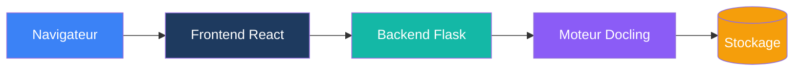

# Duckling

Une interface Web moderne et conviviale pour [Docling](https://github.com/docling-project/docling) - la puissante bibliothèque de conversion de documents d'IBM.


## Aperçu

Duckling fournit une interface Web intuitive pour convertir des documents en utilisant la bibliothèque Docling d'IBM. Que vous ayez besoin d'extraire du texte depuis des PDF, de convertir des documents Word en Markdown ou d'effectuer de l'OCR sur des images numérisées, Duckling simplifie tout.

## Fonctionnalités principales

<div class="grid cards" markdown>

-   :material-cursor-move:{ .lg .middle } __Téléversement par glisser-déposer__

    ---

    Glissez simplement vos documents sur l'interface pour un traitement instantané

-   :material-file-multiple:{ .lg .middle } __Traitement par lot__

    ---

    Convertissez plusieurs fichiers simultanément avec traitement parallèle

-   :material-format-list-bulleted:{ .lg .middle } __Support multi-formats__

    ---

    PDFs, documents Word, PowerPoints, fichiers Excel, HTML, Markdown, images et plus encore

-   :material-export:{ .lg .middle } __Formats d'export multiples__

    ---

    Exportez vers Markdown, HTML, JSON, DocTags, Document Tokens, RAG Chunks ou texte brut

-   :material-image-multiple:{ .lg .middle } __Extraction d'images et tableaux__

    ---

    Extrayez les images intégrées et les tableaux avec export CSV

-   :material-puzzle:{ .lg .middle } __Segmentation prête pour RAG__

    ---

    Générez des segments de document optimisés pour les applications RAG

-   :material-eye:{ .lg .middle } __OCR avancé__

    ---

    Plusieurs backends OCR avec support d'accélération GPU

-   :material-history:{ .lg .middle } __Historique des conversions__

    ---

    Accédez aux documents précédemment convertis à tout moment

</div>

## Démarrage rapide

Démarrez en quelques minutes :

=== "Docker (Recommandé)"

    **Démarrage en une commande avec images pré-construites :**
    ```bash
    curl -O https://raw.githubusercontent.com/davidgs/duckling/main/docker-compose.prebuilt.yml && docker-compose -f docker-compose.prebuilt.yml up -d
    ```

    **Ou construisez localement :**
    ```bash
    git clone https://github.com/davidgs/duckling.git
    cd duckling
    docker-compose up --build
    ```

=== "Développement local"

    ```bash
    # Cloner le dépôt
    git clone https://github.com/davidgs/duckling.git
    cd duckling

    # Configuration du backend
    cd backend
    python -m venv venv
    source venv/bin/activate
    pip install -r requirements.txt
    python duckling.py

    # Configuration du frontend (nouveau terminal)
    cd frontend
    npm install
    npm run dev
    ```

Accédez à l'application sur `http://localhost:3000`

## Formats pris en charge

### Formats d'entrée

| Format | Extensions | Description |
|--------|------------|-------------|
| PDF | `.pdf` | Format de document portable |
| Word | `.docx` | Documents Microsoft Word |
| PowerPoint | `.pptx` | Présentations Microsoft PowerPoint |
| Excel | `.xlsx` | Classeurs Microsoft Excel |
| HTML | `.html`, `.htm` | Pages Web |
| Markdown | `.md`, `.markdown` | Fichiers Markdown |
| Images | `.png`, `.jpg`, `.jpeg`, `.tiff`, `.gif`, `.webp`, `.bmp` | OCR direct sur images |
| AsciiDoc | `.asciidoc`, `.adoc` | Documentation technique |
| PubMed XML | `.xml` | Articles scientifiques |
| USPTO XML | `.xml` | Documents de brevets |

### Formats d'export

| Format | Extension | Description |
|--------|-----------|-------------|
| Markdown | `.md` | Texte formaté avec en-têtes, listes, liens |
| HTML | `.html` | Format prêt pour le Web avec styles |
| JSON | `.json` | Structure complète du document |
| Texte brut | `.txt` | Texte simple sans formatage |
| DocTags | `.doctags` | Format de document balisé |
| Document Tokens | `.tokens.json` | Représentation au niveau des tokens |
| RAG Chunks | `.chunks.json` | Segments pour applications RAG |

## Architecture



## Documentation

- **[Bien démarrer](getting-started/index.md)** - Guide d'installation et de démarrage rapide
- **[Guide d'utilisation](user-guide/index.md)** - Fonctionnalités et options de configuration
- **[Référence API](api/index.md)** - Documentation complète de l'API
- **[Architecture](architecture/index.md)** - Conception du système et composants
- **[Déploiement](deployment/index.md)** - Guide de déploiement en production
- **[Contribuer](contributing/index.md)** - Comment contribuer

## Remerciements- [Docling](https://github.com/docling-project/docling) par IBM pour le puissant moteur de conversion de documents
- [React](https://react.dev/) pour le framework frontend
- [Flask](https://flask.palletsprojects.com/) pour le framework backend
- [Tailwind CSS](https://tailwindcss.com/) pour le style
- [Framer Motion](https://www.framer.com/motion/) pour les animations
