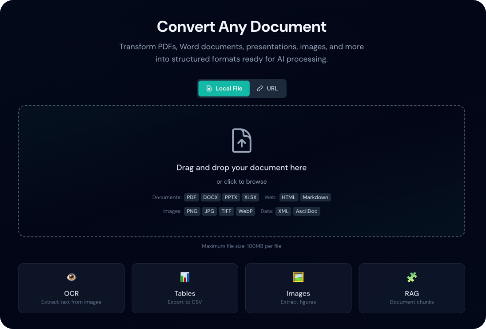
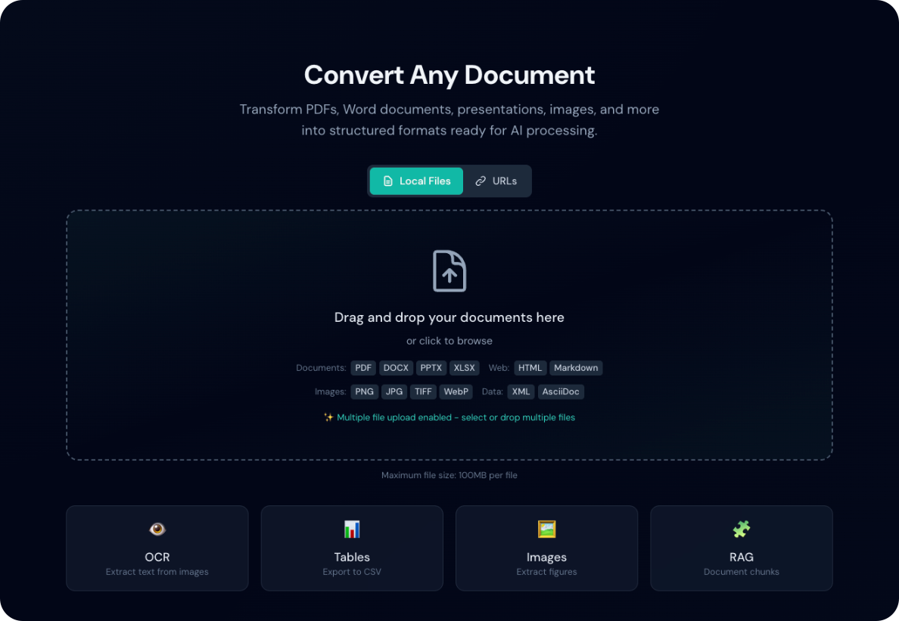

# Quick Start

Get started with Duckling in 5 minutes.

## Starting the Application

Choose your preferred method:

=== "Docker (Recommended)"

    The fastest way to get started - no dependencies to install!

    **Option 1: Pre-built Images (Fastest)**
    ```bash
    # Download the compose file
    curl -O https://raw.githubusercontent.com/davidgs/duckling/main/docker-compose.prebuilt.yml

    # Start Duckling
    docker-compose -f docker-compose.prebuilt.yml up -d
    ```

    **Option 2: Build Locally**
    ```bash
    # Clone and start
    git clone https://github.com/davidgs/duckling.git
    cd duckling
    docker-compose up --build
    ```

    The UI will be available at `http://localhost:3000`

    !!! tip "First Run"
        The first startup may take a few minutes as Docker downloads/builds the images.

=== "Manual Setup"

    ### Terminal 1: Backend

    ```bash
    cd backend
    source venv/bin/activate  # Windows: venv\Scripts\activate
    python app.py
    ```

    The API will be available at `http://localhost:5001`

    ### Terminal 2: Frontend

    ```bash
    cd frontend
    npm run dev
    ```

    The UI will be available at `http://localhost:3000`

## Your First Conversion

### 1. Open the Application

Navigate to `http://localhost:3000` in your browser.

<figure markdown="span">
  { loading=lazy }
  <figcaption>The main Duckling interface</figcaption>
</figure>

### 2. Upload a Document

Drag and drop a PDF, Word document, or image onto the drop zone, or click to browse.

<figure markdown="span">
  { loading=lazy }
  <figcaption>Upload progress indicator</figcaption>
</figure>

### 3. Watch the Progress

The conversion progress will be displayed in real-time.

<figure markdown="span">
  { loading=lazy }
  <figcaption>Real-time conversion progress</figcaption>
</figure>

### 4. Download Results

Once complete, choose your export format:

<figure markdown="span">
  { loading=lazy }
  <figcaption>Conversion complete with export options</figcaption>
</figure>

- **Markdown** - Great for documentation
- **HTML** - Web-ready output
- **JSON** - Full document structure
- **Plain Text** - Simple text extraction

## Basic Configuration

Click the :material-cog: **Settings** button to configure:

### OCR Settings

| Setting | Default | Description |
|---------|---------|-------------|
| Enabled | `true` | Enable OCR for scanned documents |
| Backend | `easyocr` | OCR engine to use |
| Language | `en` | Primary language |

### Table Settings

| Setting | Default | Description |
|---------|---------|-------------|
| Enabled | `true` | Extract tables from documents |
| Mode | `accurate` | Detection accuracy level |

### Image Settings

| Setting | Default | Description |
|---------|---------|-------------|
| Extract | `true` | Extract embedded images |
| Scale | `1.0` | Image output scale |

## Batch Processing

To convert multiple files at once:

1. Toggle **Batch Mode** in the header
2. Drag multiple files onto the drop zone
3. All files will be processed simultaneously

<figure markdown="span">
  { loading=lazy }
  <figcaption>Batch mode with multiple files</figcaption>
</figure>

!!! tip "Performance"
    Batch processing uses a job queue with a maximum of 2 concurrent conversions to prevent memory exhaustion.

## Using the API

For programmatic access, use the REST API:

```bash
# Upload and convert a document
curl -X POST http://localhost:5001/api/convert \
  -F "file=@document.pdf"

# Response
{
  "job_id": "550e8400-e29b-41d4-a716-446655440000",
  "status": "processing"
}
```

Check the [API Reference](../api/index.md) for complete documentation.

## Next Steps

- [Features](../user-guide/features.md) - Explore all capabilities
- [Configuration](../user-guide/configuration.md) - Advanced settings
- [API Reference](../api/index.md) - Integrate with your apps

