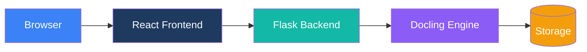

# Duckling

A modern, user-friendly graphical interface for [Docling](https://github.com/docling-project/docling) - the powerful document conversion library by IBM.


## Overview

Duckling provides an intuitive web interface for converting documents using IBM's Docling library. Whether you need to extract text from PDFs, convert Word documents to Markdown, or perform OCR on scanned images, Duckling makes it simple.

## Key Features

<div class="grid cards" markdown>

-   :material-cursor-move:{ .lg .middle } __Drag-and-Drop Upload__

    ---

    Simply drag your documents onto the interface for instant processing

-   :material-file-multiple:{ .lg .middle } __Batch Processing__

    ---

    Convert multiple files at once with parallel processing

-   :material-format-list-bulleted:{ .lg .middle } __Multi-Format Support__

    ---

    PDFs, Word docs, PowerPoints, Excel files, HTML, Markdown, images, and more

-   :material-export:{ .lg .middle } __Multiple Export Formats__

    ---

    Export to Markdown, HTML, JSON, DocTags, Document Tokens, RAG Chunks, or plain text

-   :material-image-multiple:{ .lg .middle } __Image & Table Extraction__

    ---

    Extract embedded images and tables with CSV export

-   :material-puzzle:{ .lg .middle } __RAG-Ready Chunking__

    ---

    Generate document chunks optimized for RAG applications

-   :material-eye:{ .lg .middle } __Advanced OCR__

    ---

    Multiple OCR backends with GPU acceleration support

-   :material-history:{ .lg .middle } __Conversion History__

    ---

    Access previously converted documents anytime

</div>

## Quick Start

Get started in minutes:

=== "Docker (Recommended)"

    **One-command start with pre-built images:**
    ```bash
    curl -O https://raw.githubusercontent.com/davidgs/duckling/main/docker-compose.prebuilt.yml && docker-compose -f docker-compose.prebuilt.yml up -d
    ```

    **Or build locally:**
    ```bash
    git clone https://github.com/davidgs/duckling.git
    cd duckling
    docker-compose up --build
    ```

=== "Local Development"

    ```bash
    # Clone the repository
    git clone https://github.com/davidgs/duckling.git
    cd duckling

    # Backend setup
    cd backend
    python -m venv venv
    source venv/bin/activate
    pip install -r requirements.txt
    python app.py

    # Frontend setup (new terminal)
    cd frontend
    npm install
    npm run dev
    ```

Access the application at `http://localhost:3000`

## Supported Formats

### Input Formats

| Format | Extensions | Description |
|--------|------------|-------------|
| PDF | `.pdf` | Portable Document Format |
| Word | `.docx` | Microsoft Word documents |
| PowerPoint | `.pptx` | Microsoft PowerPoint presentations |
| Excel | `.xlsx` | Microsoft Excel spreadsheets |
| HTML | `.html`, `.htm` | Web pages |
| Markdown | `.md`, `.markdown` | Markdown files |
| Images | `.png`, `.jpg`, `.jpeg`, `.tiff`, `.gif`, `.webp`, `.bmp` | Direct image OCR |
| AsciiDoc | `.asciidoc`, `.adoc` | Technical documentation |
| PubMed XML | `.xml` | Scientific articles |
| USPTO XML | `.xml` | Patent documents |

### Export Formats

| Format | Extension | Description |
|--------|-----------|-------------|
| Markdown | `.md` | Formatted text with headers, lists, links |
| HTML | `.html` | Web-ready format with styling |
| JSON | `.json` | Full document structure |
| Plain Text | `.txt` | Simple text without formatting |
| DocTags | `.doctags` | Tagged document format |
| Document Tokens | `.tokens.json` | Token-level representation |
| RAG Chunks | `.chunks.json` | Chunks for RAG applications |

## Architecture



## Documentation

- **[Getting Started](getting-started/index.md)** - Installation and quick start guide
- **[User Guide](user-guide/index.md)** - Features and configuration options
- **[API Reference](api/index.md)** - Complete API documentation
- **[Architecture](architecture/index.md)** - System design and components
- **[Deployment](deployment/index.md)** - Production deployment guide
- **[Contributing](contributing/index.md)** - How to contribute

## Acknowledgments

- [Docling](https://github.com/docling-project/docling) by IBM for the powerful document conversion engine
- [React](https://react.dev/) for the frontend framework
- [Flask](https://flask.palletsprojects.com/) for the backend framework
- [Tailwind CSS](https://tailwindcss.com/) for styling
- [Framer Motion](https://www.framer.com/motion/) for animations

